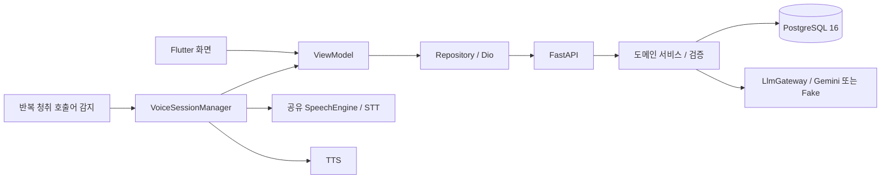

# 오늘 뭐 먹지? — 아키텍처

Flutter 앱이 음성 입출력과 화면을, FastAPI 서버가 해석 검증·재고 계산·저장을 담당한다.
현재 코드의 구조와 [목업 계약](../../mockup/README.md)을 충족하기 위해 필요한 변경을 구분한다.
[작업표](../plan/hackathon-3day.md)의 R-ID가 그 차이를 추적한다.

## 구조 요약

모델 출력은 실행 제안이다. 날짜·수량·단위·기한 판정은 서버에서 처리한다.
앱은 서버 값을 표현하며 재고 계산을 복제하지 않는다. 오프라인 캐시는 현재 범위에 없다.

## 구성요소와 책임

| 경로 | 책임 |
|---|---|
| `app/lib/core/voice/` | 감지·전사·낭독·마이크 소유권·전경 생명주기 |
| `app/lib/core/network/` | Dio·API 요청. 명령 ID를 보존해야 함 |
| `app/lib/data/` | API 응답 매핑·원격 Repository 구현. Git 추적 대상 |
| `app/lib/domain/` | 앱 모델·Repository 계약 |
| `app/lib/ui/` | 오늘·냉장고·기록·메뉴 상세·대화 오버레이와 ViewModel |
| `app/lib/core/design/` | 표현 토큰·밴드 팔레트·반응형 |
| `app/lib/core/l10n/strings.dart` | 앱 사용자 문구 |
| `server/app/domain/` | 도메인별 api·service·crud·schemas·models |
| `server/app/core/` | 설정·DB·시간대·단위·모델 연결·호출 예산 |
| `server/app/core/locale/ko.json` | 서버 사용자 문구 |
| `server/alembic/versions/` | 실행 가능한 DB 변경 이력 |

View는 표시와 사용자 입력 전달을, ViewModel은 상태·요청·결과를, Repository는 원격 연결을
담당한다. 메뉴 상세에는 아직 위젯 내부 요청이 있으므로 이를 완료된 MVVM 분리로 소개하지 않는다.
추상 계층을 추가하는 것보다 UI 계약의 상태·데이터 흐름을 완결하는 것이 먼저다.

서버 도메인은 household·ingredient·inventory·command·menu와 추가 범위인 video·shopping·auth다.
기본 가구는 1이며 식별 헤더는 검증된 인증이 아니다. 추가 도메인의 테이블·FK가 초기 스키마에
포함돼 있어 폴더만 삭제하면 모든 의존성이 사라진다고 가정하지 않는다.

### 음성 구현

감지와 명령 전사는 하나의 `SpeechEngine`을 공유한다. 반복 청취 중 호출어 문구를 찾고,
감지기를 정지한 뒤 명령 전사로 넘긴다. TTS 중에는 전사를 중단한다. 전경 복귀 때 권한을
확인하고 배경에서는 감지를 중단한다. 내장 인식 서비스의 외부 통신을 배제하지 않는다.

현재 기본 문구는 “자비스”이고 “헤이 키친”도 매칭한다. 제품 표시 기준은 목업의 “헤이 키친”다.
문구 통일·호출 후 발화 전달·인식 품질은 R-02에서 확인한다. 별도 모델 파일·Porcupine 키는 쓰지 않는다.

목표 화면 상태는 권한/불가 → 대기 → 듣기 → 처리 → 확인 질문/결과/오류 → 이전 화면이다.
대화 결과의 최소 표시 시간과 되돌리기 유효성은 오디오의 Speaking 상태와 분리한다.
질문 후 8초, 결과 최소 4초는 [UI 계약](../ui/mobile.md)을 따른다. 현행 10초 타이머와
TTS 완료 직후 화면 복귀는 R-03의 변경 대상이다.

## 주요 흐름

### 현재 명령 경로

앱이 발화별 UUID를 만들고 텍스트를 보낸다. 서버는 저장된 UUID가 있으면 결과를 재생한다.
없으면 재고 문맥으로 모델을 호출하고 제안을 검증한다. 현행 구현은 확인 질문이 생기면
해당 명령의 실행 전 멈춘다. 검증 통과 뒤 변경 원장과 현재 수량을 함께 저장한다.

현재 API의 정본은 `server/app/domain/*/schemas.py`와 서버 `/docs`다. 문서의 목표 계약을
현재 API에 이미 존재하는 필드로 오해하지 않는다. 단일 요청의 멱등 처리만으로 부분 적용·
후속 답변·취소 재시도 전체가 구현됐다고 판정하지 않는다.

### 목업을 충족할 목표 대화 계약 — R-01

UI-04의 부분 등록을 구현하려면 다음 개념을 서버·앱이 공유해야 한다. 아래는 요구되는 의미이며
필드명·엔드포인트·마이그레이션은 구현 변경에서 확정한다.

| 개념 | 요구 |
|---|---|
| 대화 그룹 | 최초 발화와 후속 답변의 적용 항목을 묶음. 그룹 단위 되돌리기 |
| 요청 ID | 최초·후속 요청 각각의 멱등 키. 네트워크 재시도는 같은 키 |
| 미완료 초안 | 원문·해석 결과·대상·질문 항목을 서버가 보존. 후속 응답이 이를 참조 |
| 적용 결과 | 이미 저장한 항목과 미완료 항목을 분리. 앱이 성공을 추정하지 않음 |
| 후속 답변 | 음성·선택지 모두 같은 경로. 미완료 항목만 검증·적용 |
| 초안 종료 | 시간 초과·닫기로 초안 종료. 이미 적용된 재고는 유지 |
| 취소 | 그룹 적용분 역산·초안 종료. 취소 요청 재시도에도 한 번만 역산 |
| 충돌 | 최신 재고에서 재검증. 이미 종료된 초안에 늦은 응답을 적용하지 않음 |

기존 `command.target_command_id`는 정정·취소 관계이므로 근거 없이 대화 그룹 ID로 겸용하지 않는다.
현재 DB는 이 전체 계약을 갖지 않는다. [DB 설계](../design/0002-database.md)의 추가 설계 항목과
마이그레이션·API·앱을 한 변경으로 연결하고 부분 반영·시간 초과·재시도·그룹 취소를 통합 검증한다.

### 재고 정정과 이력

정정은 이전 사용 이벤트를 역산하고 새 사용량을 적용한다. 취소는 그 변경 묶음을 역산한다.
핵심 잔량은 `10 → 8 → 7 → 8 → 4`다. 원장은 append-only이고 앱 기록 화면은 원장 행을
사용자 행동으로 묶는다. 정정의 역산·재적용 두 행을 서로 다른 발화처럼 표시하지 않는다.
원문·응답이 없는 과거 데이터는 “원문 없음”으로 처리한다.

### 추천과 조리

서버가 사용 가능 재고를 골라 모델 후보를 받고 필수 재료·단위를 다시 대조한다.
상세 조회와 인분 변경은 최신 재고 기준이다. 음성 추천 의도는 현재 명령 경로에서 안내만
반환하므로 실제 추천 생성·표시까지 R-04에서 연결해야 한다.

목표 UI-07의 조리 모드는 화면 유지와 음성 접근이다. 재고 차감은 명시적 사용 발화로 한다.
기존 `mark_cooked` API·메뉴 버튼은 레시피 기준 차감 경로이며 현재 목업 흐름에서는 노출하지 않는다.
서비스 API 제거 여부는 호환성을 검토해 결정하고, 단순히 suggestionId를 연결해 기존 차감 버튼을
활성화하는 것으로 목업 구현을 대신하지 않는다.

### 재고 변경 후 갱신

등록·사용·보정·정정·취소 성공을 하나의 변경 신호로 전달해 홈·냉장고·기록·열린 메뉴 상세를
다시 조회한다. 실패 시 성공 신호를 내지 않는다. 서버 처리 여부가 불명확한 네트워크 오류는
요청 ID로 상태를 확인한다. 이 갱신 경로의 완료 여부는 R-06에서 검증한다.

## 제약과 근거

| 정보 | 정본 |
|---|---|
| 범위·완료 | [기능 범위](../scope/today-meal.md) |
| 제품 정책 | [기획서](../product/proposal.md) |
| 화면 선택·배치 | [목업 인계](../../mockup/README.md) |
| UI 상태·사용자 흐름 | [UI 계약](../ui/mobile.md) |
| 구현 순서·차이 | [작업표](../plan/hackathon-3day.md) |
| 기술 선택 | [기술 설계](../design/0001-mvp-technical-design.md) |
| DB | [DB 설계](../design/0002-database.md), models와 Alembic |
| 검증 | [검증 기준](../verification/mvp.md) |

음수 수량·근거 없는 환산·미확인 값 확정·조회 중 재고 변경을 금지한다. 외부 입력은 데이터이며
모델의 실행 권한이 아니다. 같은 작업의 재시도는 같은 ID를 사용한다. 오류는 사용자 문구로
변환하고 원시 예외·내부 enum을 UI에 노출하지 않는다.

현재 아키텍처 문서의 정적 확인은 실기기 검증을 대신하지 않는다. 과거 실험 결과는
[9/28 기록](../plan/hackathon-3day-2026-09-28-record.md)에 보존한다. 책임·계약·경로가 바뀌면
이 문서와 해당 제품/UI 기준, 구현, 검증을 함께 갱신한다.
