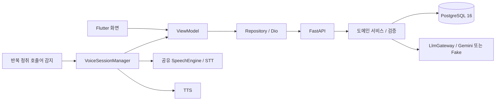

# 오늘 뭐 먹지? — 아키텍처

Flutter 앱이 음성 입출력과 화면을, FastAPI 서버가 해석 검증·재고 계산·저장을 담당한다.
현재 코드의 구조와 [목업 계약](../../mockup/README.md)을 충족하기 위해 필요한 변경을 구분한다.
[작업표](../plan/hackathon-3day.md)의 R-ID가 그 차이를 추적한다.

## 구조 요약



모델 출력은 실행 제안이다. 날짜·수량·단위·기한 판정은 서버에서 처리한다.
앱은 서버 값을 표현하며 재고 계산을 복제하지 않는다. 오프라인 캐시는 현재 범위에 없다.

## 구성요소와 책임

| 경로 | 책임 |
|---|---|
| `app/lib/core/voice/` | 감지·전사·낭독·마이크 소유권·전경 생명주기 |
| `app/lib/core/network/` | Dio·API 요청. 명령 ID를 보존해야 함 |
| `app/lib/data/` | API 응답 매핑·원격 Repository 구현. Git 추적 대상 |
| `app/lib/domain/` | 앱 모델·Repository 계약 |
| `app/lib/ui/` | 오늘·냉장고·조리·기록·마이페이지 탭, 메뉴/재료 상세, 조리 진행·완료, 대화 오버레이와 ViewModel |
| `app/lib/core/design/` | 표현 토큰·밴드 팔레트·반응형 |
| `app/lib/core/l10n/strings.dart` | 앱 사용자 문구 |
| `server/app/domain/` | 도메인별 api·service·crud·schemas·models |
| `server/app/core/` | 설정·DB·시간대·단위·모델 연결·호출 예산 |
| `server/app/core/locale/ko.json` | 서버 사용자 문구 |
| `server/alembic/versions/` | 실행 가능한 DB 변경 이력 |

View는 표시와 사용자 입력 전달을, ViewModel은 상태·요청·결과를, Repository는 원격 연결을
담당한다. 메뉴 상세에는 아직 위젯 내부 요청이 있으므로 이를 완료된 MVVM 분리로 소개하지 않는다.
추상 계층을 추가하는 것보다 UI 계약의 상태·데이터 흐름을 완결하는 것이 먼저다.

서버 도메인은 household·ingredient·inventory·command·menu와 추가 범위인 video·shopping·auth다.
호출자는 `Authorization: Bearer` 의 세션으로 판정하며 `X-User-Id`·`X-Household-Id` 는 읽지
않는다([ADR-0001](../adr/0001-verified-sessions.md)). 토큰이 없으면 게스트로 기본 가구(1)를
쓴다. `app_user`·`user_session` 은 `0003_add_email_login_and_sessions.py` 가 만든다.
추가 도메인의 테이블·FK가 초기 스키마에 포함돼 있어 폴더만 삭제하면 모든 의존성이 사라진다고
가정하지 않는다.

### 음성 구현

감지와 명령 전사는 하나의 `SpeechEngine`을 공유한다. 반복 청취 중 호출어 문구를 찾고,
감지기를 정지한 뒤 명령 전사로 넘긴다. TTS 중에는 전사를 중단한다. 전경 복귀 때 권한을
확인하고 배경에서는 감지를 중단한다. 내장 인식 서비스의 외부 통신을 배제하지 않는다.

호출어 감지(F-01)는 전용 호출어 엔진 없이 다음 경로로 동작한다. 이 수단과 “헤이 키친”을
고른 배경은 [기술 설계](../design/0001-mvp-technical-design.md#호출어-선정-배경)에 있다.

```text
기기 음성 인식(ko_KR) 반복 청취 → 여러 전사 후보 확인 → 한글 음절·영문 변형 매칭
→ 헤이 키친 호출 판정 → 감지기 정지·마이크 해제 → 명령 청취로 전환
```

| 단계 | 구현 |
|---|---|
| 반복 청취 | `wake_listen_source.dart`. `ko_KR` 받아쓰기 모드로 한 구간 최대 30초, 침묵 8초에 구간을 닫는다. 구간마다 인식 후보(`alternates`)를 모두 판정에 넘긴다 — 1순위만 보면 첫 낱말이 다르게 받아써진 구간을 놓친다 |
| 반복·재시도 | `device_wake_word_detector.dart`. 구간 사이 250ms, 실패하면 400ms부터 배로 늘려 8초까지 기다렸다 다시 듣는다. 감지하면 감지기를 멈추고 마이크를 놓아 명령 전사가 시작되게 한다 |
| 호출 판정 | `wake_phrase.dart`의 `matchWakePhrase`. 아래 규칙 |

판정은 공백·문장부호를 없애고 로마자를 소문자로 맞춘 전사에 대해 한다.

- **정확 일치**: 기본 문구 “헤이 키친”과 이전 호출어 별칭(“자비스”와 그 전사 변형, `jarvis`,
  “헤이 냉장고”). 별칭은 익숙해진 사용자를 끊지 않기 위해 남겼다.
- **두 낱말 한 벌**: “키친”처럼 들리는 말 바로 앞에 “헤이”처럼 들리는 말이 있어야 한다.
  발화 맨 앞의 “키친”만으로는 깨어나지 않는다.
- **“키친” 변형**: 로마자 전사(`kitchen`·`kitchin`·`chicken`·`kitten`·`keychain` 등)와 한글 두
  음절의 첫소리·모음·받침 조합. “치킨”처럼 두 첫소리가 뒤바뀐 전사, 받침이 떨어진 “키치”도 받는다.
  모음은 `ㅣ·ㅟ·ㅢ`로 좁혀 “기전”·“개선” 같은 흔한 낱말을 거른다.
- **“헤이” 변형**: 로마자(`hey`·`hay`·`hat`·`hi` 등), 한 글자로 줄어든 “헤”·“해”, “베이”·“하이”처럼
  “이”로 끝나는 두 글자. 발화 맨 앞의 짧은 토막(한글 2자·로마자 6자 이하)은 무엇이든 “헤이”로 본다.
- **제외**: “키친” 뒤에 “타월”·“타올”·`towel`이 붙으면 호출이 아니다.
- 호출어 뒤에 이어 말한 내용은 함께 넘겨 “헤이 키친, 계란 두 개 썼어”를 한 번에 처리한다.

이 보완은 호출어 모델을 다시 학습한 것이 아니라 전사 결과에 대한 판정 규칙을 넓힌 것이다.
첫 낱말은 짧고 약하게 발음돼 무엇으로 받아써질지 알 수 없어 표기 목록으로는 따라갈 수 없고,
그래서 소리 단위로 넓게 받는다. 코드 주석에는 SM-E426S에서 “헤이 키친”을 여섯 번 불렀을 때의
전사로 `헤이키친` 두 번, `베이키친`·`에이키친`·`hat kitchen` 한 번씩이 기록돼 있다. 이는 한 기기의
관찰이며 인식률이나 전체 품질을 검증한 결과가 아니다.

규칙은 시연에서 불러도 깨어나지 않는 것을 막는 쪽으로 기울어 있다. 대가로 TV·대화 소리 등에
잘못 깨어날 수 있고, 코드 주석은 주방에 상시 켜두는 사용에서는 범위를 다시 좁혀야 한다고 적는다.
**실기기의 호출 성공·누락·오호출은 아직 확인하지 않았다** — 문구가 맞는 것과 잘 들리는 것은
다르며 R-02가 그 확인을 갖는다.

목표 화면 상태는 권한/불가 → 대기 → 듣기 → 처리 → 확인 질문/결과/오류 → 이전 화면이다.
대화 결과의 최소 표시 시간과 되돌리기 유효성은 오디오의 Speaking 상태와 분리한다.
질문 후 8초, 결과 최소 4초는 [UI 계약](../ui/mobile.md)을 따르며 코드에 반영돼 있다.

## 주요 흐름

### 현재 명령 경로

앱이 발화별 UUID를 만들고 텍스트를 보낸다. 서버는 저장된 UUID가 있으면 결과를 재생한다.
없으면 재고 문맥으로 모델을 호출하고 제안을 검증한다. 현행 구현은 확인 질문이 생기면
해당 명령의 실행 전 멈춘다. 검증 통과 뒤 변경 원장과 현재 수량을 함께 저장한다.

현재 API의 정본은 `server/app/domain/*/schemas.py`와 서버 `/docs`다. 문서의 목표 계약을
현재 API에 이미 존재하는 필드로 오해하지 않는다. 단일 요청의 멱등 처리만으로 부분 적용·
후속 답변·취소 재시도 전체가 구현됐다고 판정하지 않는다.

### 목업을 충족할 목표 대화 계약 — R-01

UI-15의 부분 등록을 구현하려면 다음 개념을 서버·앱이 공유해야 한다. 아래는 요구되는 의미이며
필드명·엔드포인트·마이그레이션은 구현 변경에서 확정한다.

| 개념 | 요구 |
|---|---|
| 대화 그룹 | 최초 발화와 후속 답변의 적용 항목을 묶음. 그룹 단위 되돌리기 |
| 요청 ID | 최초·후속 요청 각각의 멱등 키. 네트워크 재시도는 같은 키 |
| 미완료 초안 | 원문·해석 결과·대상·질문 항목을 서버가 보존. 후속 응답이 이를 참조 |
| 적용 결과 | 이미 저장한 항목과 미완료 항목을 분리. 앱이 성공을 추정하지 않음 |
| 후속 답변 | 음성·선택지 모두 같은 경로. 미완료 항목만 검증·적용 |
| 초안 종료 | 시간 초과·닫기로 초안 종료. 이미 적용된 재고는 유지 |
| 취소 | 그룹 적용분 역산·초안 종료. 취소 요청 재시도에도 한 번만 역산 |
| 충돌 | 최신 재고에서 재검증. 이미 종료된 초안에 늦은 응답을 적용하지 않음 |

기존 `command.target_command_id`는 정정·취소 관계이므로 근거 없이 대화 그룹 ID로 겸용하지 않는다.
현재 DB는 이 전체 계약을 갖지 않는다. [DB 설계](../design/0002-database.md)의 추가 설계 항목과
마이그레이션·API·앱을 한 변경으로 연결하고 부분 반영·시간 초과·재시도·그룹 취소를 통합 검증한다.

### 재고 정정과 이력

정정은 이전 사용 이벤트를 역산하고 새 사용량을 적용한다. 취소는 그 변경 묶음을 역산한다.
핵심 잔량은 `10 → 8 → 7 → 8 → 4`다. 원장은 append-only이고 앱 기록 화면은 원장 행을
사용자 행동으로 묶는다. 정정의 역산·재적용 두 행을 서로 다른 발화처럼 표시하지 않는다.
원문·응답이 없는 과거 데이터는 “원문 없음”으로 처리한다.

### 추천과 조리

서버가 사용 가능 재고를 골라 모델 후보를 받고 필수 재료·단위를 다시 대조한다.
상세 조회와 인분 변경은 최신 재고 기준이다. 음성 추천 의도는 현재 명령 경로에서 안내만
반환하므로 실제 추천 생성·표시까지 R-04에서 연결해야 한다.

### 영상 레시피

`/api/video/analyze` 는 유튜브 주소를 **모델에 그대로 보낸다**. 한국 요리 채널의 설명글은
재료와 계량만 적고 조리 순서는 영상 안에만 두는 경우가 많아, 글만 읽던 이전 방식으로는
대부분의 영상에서 순서를 얻지 못했다. 설명글은 영상과 함께 보내 계량을 보강한다.

| 항목 | 규칙 |
|---|---|
| 입력 | 영상 주소(`fileData`) + 제목·설명·자막. 둘 다 없으면 거부한다 |
| 글 조회 | `youtube.py`. 키가 있으면 YouTube Data API로 제목·설명글·길이를, 없으면 oEmbed로 제목만 받는다. 자막은 공개 자막을 따로 받는다. 이 경로는 영상 내용을 분석하지 않는다 |
| 순서 | 영상에서 읽는다 |
| 계량 | 설명글을 우선한다. 어긋나면 글을 쓰고 `unresolved` 에 남긴다 |
| 비용 | 길이가 곧 비용이다. 실측 분당 약 $0.0065. `video_max_seconds`(기본 1200초)를 넘으면 글만 보낸다 |
| 캐시 | `(video_id, prompt_version)` 으로 저장한다. 글을 못 읽은 실패만 다시 시도한다 |

프롬프트를 바꾸면 `video_ko.VERSION` 을 올려 옛 결과를 새 프롬프트의 것처럼 쓰지 않는다.

### 추천과 조리 화면

조리는 추천(UI-06→UI-10)과 영상 분석(UI-09→UI-10) 두 경로로 시작한다. 진행 화면은 단계·
타이머·낭독·조리 음성 명령을 맡고 전경 화면을 유지한다. 시작만으로는 재고를 바꾸지 않는다.

**조리 완료(UI-11)는 재고를 바꾸는 명령이다.** `POST /api/menu/suggestions/{id}/cooked` 가
레시피 재료를 재고와 대조해 뺄 수 있는 것만 빼고, `Command` 행을 남기며 `undo_token`(명령 ID)을
돌려준다. `consumption_applied` 가 중복 차감을 막고, 질문이 돌아오면 아무것도 반영하지 않은
상태다. 영상에서 시작한 조리에는 차감 단위가 없으므로 이 경로를 쓰지 않는다.

앱은 화면에서 조리한 인분(`CookPlan.servings`)을 `servings` 로 실어 보내고 서버가 그 값으로
환산하며 추천에도 반영한다. 완료 화면의 되돌리기는 `undo_token` 을
`POST /api/command/{command_id}/undo` 로 보내고, 성공하면 뺐다는 표시를 거둔다.

조리 단계 낭독·조리 중 음성 명령(“다음”·“다시 읽어 줘”·“타이머 3분”)은 아직 연결되지 않았다.
대화 오버레이는 탭 셸 안에 있고 조리 화면은 그 위에 별도 경로로 열리므로, 다른 화면의 화면
유지·오버레이 코드가 조리 화면에 그대로 적용된다고 가정하지 않는다. R-04가 그 차이를 갖는다.

### 수동 편집 경로

재료 상세는 `PATCH /api/inventory/batches/{id}` 와 `DELETE /api/inventory/batches/{id}` 를
쓰며 음성과 같은 원장에 남는다. 복구는 `change_event.restore_payload`(마이그레이션 0004)가
맡는다 — 바꾸기 전의 이름·재료·보관 위치·날짜·버림 표시를 담고, 되돌리기가 그 값을 그대로
다시 쓴다. 수량은 기존 `quantity_before` 가 갖고 있어 여기 담지 않는다.

| 항목 | 규칙 |
|---|---|
| 이름·날짜·위치 변경 | 이전 값을 스냅샷으로 남기고 되돌리기가 복원. 편집이 새로 만든 날짜 줄은 되돌리면 사라진다 |
| 버리기 | `deleted_at` 으로 숨기고 되돌리기가 그 표시를 푼다 |
| 요청 ID | 앱이 만든 `command_id` 를 그대로 쓴다. 같은 ID 가 이미 있으면 다시 적용하지 않는다 |
| 삭제 재시도 | 이미 버린 묶음에 다시 보내도 204 다. 재시도를 실패로 만들지 않는다 |

### 기록과 재고 변경 후 갱신

`GET /api/command/history` 는 전체를 최근순으로 돌려주고 `on` 을 주면 그날 하루만 돌려준다.
앱은 **날짜로 자르지 않고 전체를 최근순으로** 읽는다. 화면은 대화처럼 쌓아 아래가 가장
최근이며 열 때 그 끝을 보여주고, 되돌리기는 전체에서 가장 최근의 되돌릴 수 있는 변경에만 준다.
`historyDays` 는 계약에 남지만 화면은 쓰지 않는다.

등록·사용·보정·정정·취소·조리 완료·수동 편집 성공을 하나의 변경 신호로 전달해 홈·냉장고·조리
추천·기록·열린 상세를 다시 조회한다. 현재는 공통 신호가 없어 일부 화면이 탭 재진입에 의존하고,
조리 추천은 기존 목록이 있으면 다시 읽지 않는다. 계정이 바뀌면 싱글턴 ViewModel의 목록을
명시적으로 비우고 다시 읽어야 한다. 실패 시 성공 신호를 내지 않는다. 서버 처리 여부가
불명확한 네트워크 오류는 요청 ID로 상태를 확인한다. 이 갱신 경로의 완료 여부는 R-06에서 검증한다.

## 제약과 근거

| 정보 | 정본 |
|---|---|
| 범위·완료 | [기능 범위](../scope/today-meal.md) |
| 제품 정책 | [기획서](../product/proposal.md) |
| 화면 선택·배치 | [목업 인계](../../mockup/README.md) |
| UI 상태·사용자 흐름 | [UI 계약](../ui/mobile.md) |
| 구현 순서·차이 | [작업표](../plan/hackathon-3day.md) |
| 기술 선택 | [기술 설계](../design/0001-mvp-technical-design.md) |
| DB | [DB 설계](../design/0002-database.md), models와 Alembic |
| 검증 | [검증 기준](../verification/mvp.md) |

음수 수량·근거 없는 환산·미확인 값 확정·조회 중 재고 변경을 금지한다. 외부 입력은 데이터이며
모델의 실행 권한이 아니다. 같은 작업의 재시도는 같은 ID를 사용한다. 오류는 사용자 문구로
변환하고 원시 예외·내부 enum을 UI에 노출하지 않는다.

현재 아키텍처 문서의 정적 확인은 실기기 검증을 대신하지 않는다. 과거 실험 결과는
[9/28 기록](../plan/hackathon-3day-2026-09-28-record.md)에 보존한다. 책임·계약·경로가 바뀌면
이 문서와 해당 제품/UI 기준, 구현, 검증을 함께 갱신한다.
