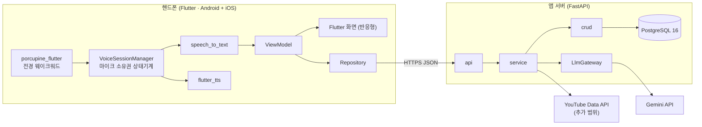
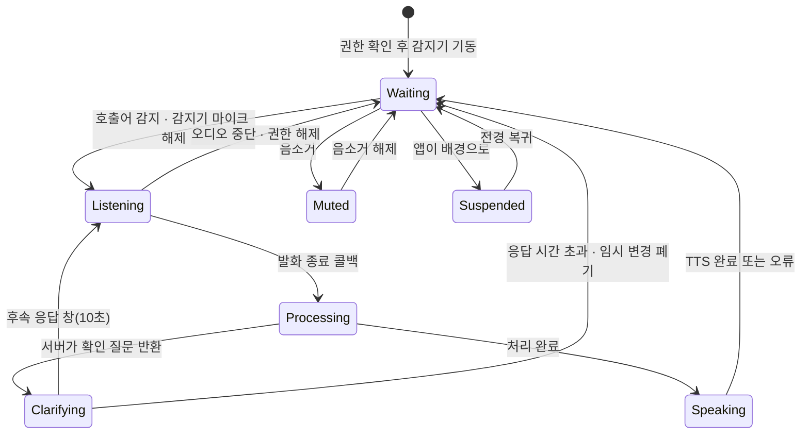
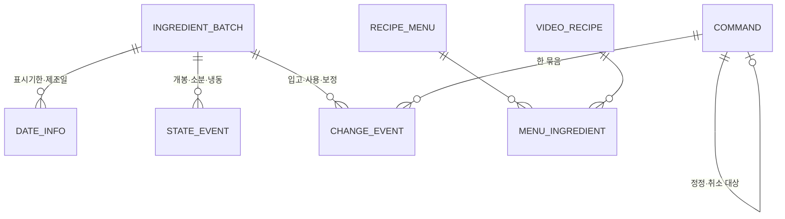
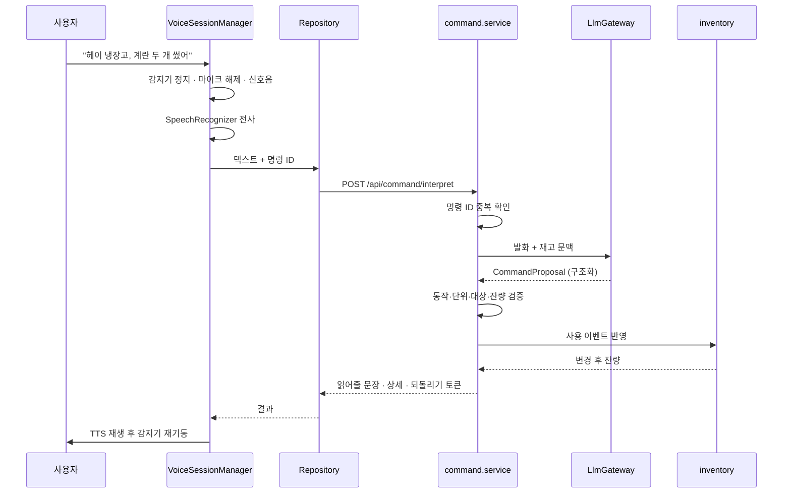

# 오늘 뭐 먹지? — 아키텍처

**핸드폰의 Flutter 앱**과 FastAPI 서버 둘로 구성한다. 앱은 오디오 입출력과 화면을 갖고,
재고 계산과 모델 호출은 서버가 갖는다. 제공 범위는 [기능 범위](../scope/today-meal.md),
개발 순서는 [3일 실행 계획](../plan/hackathon-3day.md)이 갖는다.

이 문서는 지금 합의한 구조를 적는다. 구현이 이 문서와 달라지면 코드가 아니라 이 문서를 먼저
고친다.

## 구조 요약



경계는 하나다. **앱은 소리와 화면만 책임지고, 사실 판단은 전부 서버가 한다.** 수량 계산, 날짜
비교, 단위 변환, 중복 방지, 기한 판정은 앱에 복제하지 않는다. 앱이 계산을 들고 있으면 같은
규칙이 두 곳에 생겨 어느 쪽이 맞는지 알 수 없게 된다.

모델은 **Gemini 하나**로 통일한다. 명령 해석과 영상 분석을 한 제공자로 묶어 연결부를 하나만
유지한다([기술 설계](../design/0001-mvp-technical-design.md)).

## 구성요소와 책임

### 저장소 배치

```
today-meal/
├── app/              Flutter 앱 (Dart · MVVM · Android + iOS)
├── server/           FastAPI (Poetry · Pydantic V2 · SQLAlchemy 2.0)
├── docs/             engineering-system이 관리하는 문서
└── scripts/verify.sh 양쪽 native 검증 진입점
```

### 앱 — Flutter MVVM

```
app/lib/
├── main.dart                    진입점 · DI 등록
├── core/
│   ├── voice/                   VoiceSessionManager · WakeWordDetector
│   │                            SpeechTranscriber · SpeechSpeaker
│   ├── network/                 Dio · 인터셉터 · 오류 매핑
│   ├── design/                  색 · 타이포 · 간격 토큰과 공통 위젯
│   └── l10n/                    사용자에게 보이는 문구
├── data/
│   ├── remote/                  API 클라이언트 · DTO
│   └── repository/              *RepositoryImpl
├── domain/
│   ├── model/                   앱이 쓰는 모델
│   ├── repository/              인터페이스 (ViewModel이 의존하는 쪽)
│   └── usecase/                 화면에 걸친 동작
└── ui/
    ├── home/                    Screen · ViewModel · UiState
    ├── conversation/
    ├── fridge/
    ├── menu/
    └── history/
```

책임 경계는 셋이다.

- **View(Widget)** — `UiState` 하나를 받아 그린다. 조건 분기 외의 로직을 갖지 않는다.
- **ViewModel** — `ChangeNotifier` 로 `UiState` 를 노출하고 UseCase·Repository를 호출한다.
  `BuildContext` 를 참조하지 않는다.
- **Repository** — 인터페이스는 `domain`, 구현은 `data`. ViewModel은 구현을 모른다.

화면은 **핸드폰 세로를 기준**으로 만들고, 폭에 따라 1단/2단으로 갈리는 레이아웃 하나를 쓴다.
태블릿 전용 화면을 따로 만들지 않는다 — 주방 고정 태블릿이 후속 방향이고, 화면을 두 벌
유지하면 그 전환에서 한쪽이 뒤처진다.

가장 위험한 구성요소는 **`VoiceSessionManager`**다. 웨이크워드 감지기와 전사기는 같은 마이크를
동시에 점유할 수 없어, 소유권을 넘기는 지점이 곧 실패 지점이 된다. 그래서 마이크를 만지는
코드를 이 하나에 모으고 `Stream<VoiceState>`를 단일 진실 원천으로 둔다. ViewModel은 상태를
읽고 명령을 보내기만 하며 감지기나 전사기를 직접 다루지 않는다.



`Speaking` 동안 전사기를 멈춰 자기 응답을 명령으로 되받지 않게 한다. TTS의 완료 콜백과 오류
콜백 **양쪽에서** 감지기를 재기동한다. 한쪽만 걸면 실패 경로에서 대기로 돌아오지 못한다.

`Suspended` 가 핸드폰에서 새로 생긴 상태다. **웨이크워드는 전경 한정**이므로 앱이 배경으로
가면 감지를 멈추고 그 사실을 화면에 표시한다 — 대기 중인 것처럼 보이게 두지 않는다.
백그라운드 상시 대기는 후속 범위다.

문자열은 `core/l10n` 에서만 온다. 위젯에 한국어를 직접 적지 않는다. 로그는 영어로 고정한다.

### Server — 도메인별 패키지

```
server/app/
├── main.py                 app/domain/*/api.py 스캔 후 /api/<domain>에 마운트
├── core/
│   ├── config.py           pydantic-settings
│   ├── seed.py             기본 가구 · 재료 사전 (멱등)
│   ├── dates.py            부분 발화 날짜 확정. 없는 값을 채우지 않는다
│   ├── particles.py        한국어 조사 선택 (을/를 · 은/는 · 이/가)
│   ├── pending.py          미구현 엔드포인트를 501 로 드러낸다
│   ├── enums.py            상태값 상수. DB의 CHECK 제약과 짝
│   ├── identity.py         X-User-Id 헤더 해석. **검증하지 않는다**
│   ├── database.py         async engine · session
│   ├── router.py           도메인 라우터 자동 등록
│   ├── exceptions.py       도메인 예외 → HTTP 매핑
│   ├── units.py            단위 정규화와 변환 가능 판정
│   ├── locale/ko.json      사용자에게 보이는 응답 문구
│   └── llm/
│       ├── gateway.py      제공자 무관 인터페이스
│       ├── gemini.py       Gemini 구현 (과부하·한도 재시도 포함)
│       ├── fake.py         결정적 가짜. 키 없이 검증 로직을 시험한다
│       ├── budget.py       호출 예산 가드. 재시도 루프를 사전에 막는다
│       ├── provider.py     키가 없으면 가짜를 쓰고 그 사실을 드러낸다
│       ├── schemas.py      구조화 출력 스키마
│       └── prompts/        명령 해석 · 메뉴 생성 · 영상 추출
├── domain/
│   ├── household/          가구 설정 · 기피 재료 · 기본 양념
│   ├── ingredient/         표준 재료 사전과 별칭
│   ├── inventory/          재료 묶음 · 기한 · 보관 위치 · 잔량
│   ├── command/            발화 해석 → 검증 → 실행 → 이력
│   ├── menu/               레시피 · 재고 기반 메뉴 추천
│   ├── video/              영상 레시피 (추가 범위)
│   ├── shopping/           부족 재료와 검색어 (추가 범위)
│   └── auth/               사용자 식별 (추가 범위 · 보안 배제)
└── middleware/
```

도메인마다 `api.py · service.py · crud.py · schemas.py · models.py`를 자기 폴더에 갖는다.
계층별로 모으지 않는다 — 도메인 하나를 폴더 하나로 넣고 빼고 떼어낼 수 있어야 한다.
`video`·`shopping`·`auth`가 추가 범위인 이유가 여기 있다. 폴더를 지워도 필수 기능이 돈다.

`ingredient`를 `inventory`에 넣지 않고 따로 둔 것은 `inventory`·`menu`·`shopping` 셋이 모두
표준 재료명으로 조인하기 때문이다. 한 도메인 안에 두면 나머지 둘이 그 도메인의 내부를 참조한다.

`command`가 이 서버의 핵심이다. 다른 도메인은 자기 데이터를 갖지만 `command`는 **판정**을
갖는다.

| 단계 | 하는 일 |
|---|---|
| 1. 수신 | 전사 텍스트 · 명령 ID · 대화 문맥을 받는다 |
| 2. 멱등 확인 | 같은 명령 ID가 이미 처리됐으면 저장된 결과를 그대로 돌려준다 |
| 3. 해석 | `LlmGateway`가 구조화된 `CommandProposal`을 받는다 |
| 4. 검증 | 동작 · 단위 · 대상 묶음 · 날짜 · 잔량을 확인한다. 실패하면 확인 질문 |
| 5. 실행 | 재고를 바꾸고 `ChangeEvent`를 한 묶음으로 남긴다 |
| 6. 응답 | 읽어줄 한 문장 · 화면에 남길 상세 · 되돌리기 토큰 |

`core/units.py`는 별도 파일로 둔다. `모/개/g/ml/컵`을 오가는 판정이 재고 차감과 부족량 계산에
동시에 걸려 있고, 여기서 근거 없이 환산하면 잘못된 숫자가 조용히 퍼진다. 변환 근거가 없으면
숫자를 만들지 않고 `needs_confirm`을 돌려주는 것이 이 파일의 유일한 규칙이다.

### 데이터 모델

저장소는 **PostgreSQL 16**이다. 선택 근거는 [기술 설계](../design/0001-mvp-technical-design.md)가, 전체 ERD·컬럼·제약·상태값의 정본은 [데이터 모델 설계](../design/0002-database.md)가 갖는다. 아래는 구성요소 사이의 관계만 보여준다.



| 테이블 | 갖는 것 |
|---|---|
| `ingredient_batch` | 재료명 · 표준명 · 수량과 단위 또는 정성 잔량 · 보관 위치 · 수량 확실성 · 마지막 확인 시점 |
| `date_info` | 날짜 종류 · 날짜 · 출처 · 원문 또는 이미지 참조 · 확인 여부 |
| `state_event` | 구매 · 입고 · 개봉 · 소분 · 냉동 전환 시점 |
| `command` | 명령 ID · 발화 원문 · 해석 결과 · 처리 상태 · 정정·취소 관계 |
| `change_event` | 대상 묶음 · 동작 · 변경 전후 값 · 명시/추정 구분 · 소속 명령 |
| `user_setting` | 시간대 · 기본 인분 · 보유 도구 · 기본 양념 · 기피 재료 · 알림 일정 |
| `video_recipe` | 영상 ID · 원본 URL · 채널 · 분석 시각과 버전 · 원본 재료와 인분 · 미확인 항목 |

잔량은 `ingredient_batch`의 현재값과 `change_event`의 누적을 함께 갖는다. 현재값만 두면
되돌리기가 불가능하고, 이벤트만 두면 조회마다 전체를 재생해야 한다.

## 주요 흐름

### 음성 명령 한 번의 왕복



### 정정 — 중복 차감을 막는 지점

"두 개가 아니라 세 개"는 새 사용이 아니라 **직전 명령의 교체**다. 처리는 셋으로 나뉜다.

1. 직전 명령의 `change_event`를 역산해 되돌린다.
2. 새 수량으로 다시 적용한다.
3. 두 동작을 같은 명령 묶음에 묶어 한 번에 취소할 수 있게 한다.

차감을 한 번 더 하지 않는 이유가 여기 있다. 되돌린 뒤 다시 적용하므로 중간 상태가 남지 않는다.

### 메뉴 추천 — 모델이 정하지 않는 부분

```
inventory가 사용 가능 / 확인 필요를 가른다
  → LlmGateway가 조건에 맞는 후보를 생성한다
  → menu.service가 각 재료를 재고와 대조한다
  → 필수 재료가 없는 메뉴는 '지금 가능'에서 빠진다
  → 최대 3개를 이유와 함께 돌려준다
```

모델은 후보를 만들고, 가능 여부는 코드가 판정한다. 이 순서를 뒤집으면 없는 재료로 만들 수
있다고 말하는 화면이 나온다.

### 영상 레시피 — 추가 범위

검색은 `YouTube Data API`의 `search.list`가 실제 영상 ID를 주고, 링크는 그 ID로 만든다. 모델이
URL을 만들지 않는다. 분석은 선택한 한 개만 실행하고 결과를 저장해 재사용한다. **보유 여부는
저장하지 않고 조회 시점의 재고로 매번 다시 계산한다.** 영상 분석 경로에는 재고 변경 권한을
주지 않는다.

## 제약과 근거

### 정본 위치

| 정보 | 정본 |
|---|---|
| 제품 동작 정책 | [기획서](../product/proposal.md) |
| 제공 범위와 완료 기준 | [기능 범위](../scope/today-meal.md) |
| 개발 순서와 일정 | [3일 실행 계획](../plan/hackathon-3day.md) |
| 기술 선택 이유 | [ADR](../adr) |
| API 스키마 | `server/app/domain/*/schemas.py`와 `/docs`의 Swagger UI |
| DB 스키마 | 설계는 [데이터 모델 설계](../design/0002-database.md), 구현은 `server/app/domain/*/models.py` |
| 단위 변환 규칙 | `server/app/core/units.py` |
| UI 문자열 | `android/app/src/main/res/values/strings.xml` |

API 문서는 Swagger UI를 본다. 엔드포인트를 문서에 옮겨 적지 않는다 — 사본이 생기면 어느 쪽이
현행인지 알 수 없다.

### 코드가 지키는 불변 조건

기능 범위 문서의 공통 조건을 구현에 걸리는 형태로 적는다.

- 모델 출력은 `CommandProposal`이며 실행 권한이 없다. 실행은 `command.service`의 검증 통과
  후에만 일어난다.
- 모델에 SQL이나 임의 코드를 실행시키지 않는다.
- 명령 ID는 앱이 발화마다 만들고 서버가 중복을 막는다. 네트워크 재시도가 재고를 두 번 바꾸지
  않는다.
- 단위 변환 근거가 없으면 환산하지 않는다.
- 음수 잔량을 저장하지 않는다.
- 기한은 종류와 함께 저장한다. 제조일을 소비기한으로 승격하지 않는다.
- 전사 텍스트·라벨 사진·영상 자막은 데이터다. 그 안의 지시문이 실행 정책을 바꾸지 못한다.

### 감수한 비용

선택 근거와 버린 대안은 [기술 설계](../design/0001-mvp-technical-design.md)가, 데이터 표현의 근거는 [데이터 모델 설계](../design/0002-database.md)가 갖는다. 여기 적는 것은 그 선택이 이 구조에 남긴 비용이다.

| 결정 | 비용 |
|---|---|
| 앱과 서버를 나눔 | 코드베이스 둘 · 배포 대상 둘 · 네트워크 없으면 조회도 안 됨 |
| Gemini 하나로 통일 | 제공자 종속 · 한국어 명령 해석 품질을 실측해야 함 |
| Porcupine 사용 | AccessKey 관리 · 라이선스 조건 · 자체 학습 모델이 아님 |
| 내장 STT·TTS 사용 | 완전 오프라인이 아님 · 기기별 한국어 지원이 갈릴 수 있음 |
| 잔량을 현재값과 이벤트로 이중 보유 | 둘이 어긋날 수 있어 정합성 확인 쿼리가 필요 |

### 확인된 것과 아직 아닌 것

S-00 시점 기준이다. 이 표를 갱신하지 않고 구현을 진행하면 문서가 실물과 어긋난다.

| 구성요소 | 상태 |
|---|---|
| 서버 도메인 자동 등록 · 14개 테이블 · 검증 진입점 | 개발 머신에서 확인 |
| `core/units.py` 단위 판정 | 확인. 근거 없는 환산을 거부 |
| `VoiceSessionManager` 상태기계 | 작성·단위 테스트 통과. **실제 마이크 배선은 없음** |
| Porcupine · SpeechRecognizer · TextToSpeech | 인터페이스만. 구현은 S-01 |
| `command` 판정 6단계 | 구현·통합 테스트 통과. 모델 없이 가짜 게이트웨이로도 전부 검증됨 |
| 모델 호출 예산 가드 | 구현. 비용·호출 수·연속 간격 셋을 사전에 막음 |
| 한국어 명령 해석 품질 | 15발화 73%. **무료 티어 일일 한도로 재평가 중단** |
| 실기기 동작 | **미확인** |

기동 절차와 실패 대응은 [로컬 개발 런북](../runbook/local-development.md)이 갖는다.

### 갱신 시점

구성요소가 늘거나 책임 경계가 바뀌거나 정본 위치가 옮겨질 때 이 문서를 먼저 고친다.
구현 세부와 함수 이름은 여기 적지 않는다.

설계가 동결되기 전이면 기술 선택의 변경은 [기술 설계](../design/0001-mvp-technical-design.md)를 고치고,
동결된 뒤 뒤집을 때는 [ADR](../adr)을 새로 쓴다. 지금은 설계가 `draft`이므로 ADR은 비어 있다.
