# 0002. 데이터 모델 설계

[기능 범위](../scope/today-meal.md)의 필수 16개와 추가 5개를 담는 PostgreSQL 16 스키마를 정한다.
[아키텍처](../architecture/README.md)가 개략 ERD를 가졌으나 컬럼·제약·상태값이 없어 구현에 바로
쓸 수 없었다. 이 문서가 그 정본이다.

설계를 가른 질문은 하나다 — **잘못 반영된 재고를 어떻게 되돌리는가.** 잔량만 들고 있으면
되돌릴 수 없고, 이벤트만 들고 있으면 조회마다 전체를 재생해야 한다. 이 문서의 절반은 그 답이다.

## 제안 요약

테이블 **14개**다. 필수 11개와 추가 3개로 가르며, 추가 쪽을 지워도 필수 기능이 돈다.

| 그룹 | 테이블 | 담는 것 |
|---|---|---|
| 가구·설정 | `household` · `household_ingredient_preference` | 시간대 · 기본 인분 · 도구 · 알림 일정 · 기피 재료 · 기본 양념 |
| 재료 사전 | `ingredient` | 표준 재료명과 별칭 |
| 재고 | `ingredient_batch` · `batch_date` · `batch_state_event` | 묶음 잔량 · 기한 · 개봉·소분·냉동 |
| 명령 | `command` · `change_event` | 발화 해석 · 수량 변경 이력 · 정정·취소 |
| 레시피 | `recipe` · `recipe_ingredient` · `menu_suggestion` | 레시피 · 재료 · 추천과 조리 확인 |
| 추가 | `video_recipe` · `shopping_item` · `app_user` | 영상 레시피 · 장보기 · 사용자 식별 |

### 이 설계가 지키는 것

기능 범위 문서의 공통 불변 조건 가운데 **DB 제약으로 내릴 수 있는 것을 코드가 아니라 스키마에
건다.** 코드의 실수가 데이터를 망가뜨리지 못하게 하려는 것이다.

| 불변 조건 | 스키마가 지키는 방법 |
|---|---|
| 같은 발화를 재시도해도 한 번만 반영 | `command.command_id`를 앱이 만든 UUID로 두고 **PK**로 쓴다. 재시도는 PK 충돌이 되어 저장된 결과를 그대로 돌려준다 |
| 음수 잔량을 저장하지 않음 | `ingredient_batch`에 `CHECK (quantity >= 0)` |
| 기한 종류를 보존하고 임의 변환하지 않음 | `batch_date.kind`를 종류별 행으로 분리. `(batch_id, kind)` UNIQUE |
| 미확인 기한을 확정값으로 승격하지 않음 | `batch_date.date`를 nullable로 두고 `is_confirmed`를 별도 컬럼으로 |
| 명시값과 추정값을 구분 | `quantity_certainty`와 `change_event.certainty` |
| 조리 확인만으로 중복 차감하지 않음 | `menu_suggestion.consumption_applied` |
| 되돌리기가 가능 | `change_event`를 append-only로 두고 `reverses_event_id`로 역산 이벤트를 연결 |

### 채택하지 않은 것

**코드 테이블(`code_master`)을 만들지 않는다.** 상태값은 `VARCHAR` + `CHECK` 제약으로 둔다.
상태값이 3개를 넘지만 사용자가 런타임에 추가할 수 있는 값이 하나도 없다 — 전부 제품 로직에
고정된 값이다. 코드 테이블은 사용자가 값을 관리할 때 값을 한다.

**`*_history` 테이블을 만들지 않는다.** `change_event`가 이미 이벤트 원장이다. 이력 테이블을
따로 두면 같은 사실이 두 곳에 생긴다.

**`notification_log`를 만들지 않는다.** MVP 알림은 화면 카드와 음성 응답뿐이고 발송 이력이
없다. 모바일 푸시는 후속 범위다.

**`file_attachments`를 만들지 않는다.** 첨부는 라벨 사진 하나이고 대상도 기한 정보 하나다.
`batch_date.source_image_uri` 컬럼으로 끝난다. 폴리모픽 첨부 테이블은 대상이 여럿일 때 값을 한다.

**재료별 단위 환산 테이블을 만들지 않는다.** `g↔kg`·`ml↔L` 같은 보편 환산은
`server/app/core/units.py`가 갖고, `모→g`처럼 제품마다 다른 환산은 **근거가 없으므로 하지 않는다.**
환산하지 않고 확인을 요청하는 것이 이 제품의 정책이다.

## 설계

### ERD

```mermaid
erDiagram
    household ||--o{ app_user : "소속"
    household ||--o{ household_ingredient_preference : "기피·기본양념"
    household ||--o{ ingredient_batch : "보유"
    household ||--o{ command : "발화"
    household ||--o{ menu_suggestion : "추천받음"
    household ||--o{ shopping_item : "장보기"

    ingredient ||--o{ household_ingredient_preference : ""
    ingredient ||--o{ ingredient_batch : "표준명"
    ingredient ||--o{ recipe_ingredient : ""
    ingredient ||--o{ shopping_item : ""

    ingredient_batch ||--o{ batch_date : "기한 정보"
    ingredient_batch ||--o{ batch_state_event : "개봉·소분·냉동"
    ingredient_batch ||--o{ change_event : "수량 변경"
    ingredient_batch ||--o| ingredient_batch : "소분 분리"

    command ||--o{ change_event : "한 묶음"
    command ||--o{ batch_state_event : ""
    command ||--o| command : "정정·취소 대상"
    command ||--o{ menu_suggestion : "추천 유발"

    change_event ||--o| change_event : "역산 대상"

    recipe ||--o{ recipe_ingredient : ""
    recipe ||--o{ menu_suggestion : ""
    video_recipe ||--o| recipe : "영상 유래"
    recipe ||--o{ shopping_item : "부족 재료"

    household {
        bigint household_id PK
        varchar timezone "가구 시간대"
        smallint default_servings "기본 인분"
        text tools "보유 도구 배열"
        smallint expiry_alert_days "D-3 D-1 당일"
    }
    ingredient {
        bigint ingredient_id PK
        varchar canonical_name UK "표준 재료명"
        text aliases "음성 표현 배열"
        varchar category
        varchar default_unit
    }
    household_ingredient_preference {
        bigint household_id PK
        bigint ingredient_id PK
        varchar kind PK "avoided allergy pantry_staple"
    }
    ingredient_batch {
        bigint batch_id PK
        bigint household_id FK
        bigint ingredient_id FK
        varchar raw_name "사용자 발화 원문"
        numeric quantity "정성이면 NULL"
        varchar unit
        varchar qualitative_amount "조금 반 많이"
        varchar quantity_certainty "exact estimated qualitative"
        varchar storage_location "fridge freezer pantry unknown"
        bigint split_from_batch_id FK
        timestamptz last_confirmed_at
        timestamptz depleted_at
        timestamptz deleted_at
    }
    batch_date {
        bigint batch_date_id PK
        bigint batch_id FK
        varchar kind "use_by sell_by best_before manufactured packed check_reminder"
        date date_value "미확인이면 NULL"
        boolean is_confirmed
        varchar source "voice label_photo manual"
        varchar raw_text "원문 표기"
        text source_image_uri
    }
    batch_state_event {
        bigint state_event_id PK
        bigint batch_id FK
        uuid command_id FK
        varchar kind "purchased stocked_in opened portioned frozen thawed moved"
        timestamptz occurred_at
        varchar from_location
        varchar to_location
    }
    command {
        uuid command_id PK "앱이 만든 멱등 키"
        bigint household_id FK
        text utterance "전사 원문"
        varchar intent "register consume adjust query correct cancel recommend plan_future unknown"
        varchar status "pending clarifying applied rejected failed superseded reverted"
        jsonb proposal "모델 원본 제안"
        text clarification_question
        text spoken_response
        uuid target_command_id FK "정정·취소 대상"
        varchar llm_model
        varchar prompt_version
        integer latency_ms
    }
    change_event {
        bigint change_event_id PK
        uuid command_id FK
        bigint batch_id FK
        varchar action "stock_in consume adjust discard move split revert"
        numeric quantity_delta
        numeric quantity_before
        numeric quantity_after
        varchar unit
        varchar certainty "exact estimated qualitative"
        bigint reverses_event_id FK
    }
    recipe {
        bigint recipe_id PK
        bigint household_id FK "NULL이면 전역 seed"
        varchar name
        varchar source "seed llm video"
        smallint base_servings
        smallint estimated_minutes
        jsonb steps "순서 있는 조리 단계"
        bigint video_recipe_id FK
    }
    recipe_ingredient {
        bigint recipe_ingredient_id PK
        bigint recipe_id FK
        bigint ingredient_id FK "매칭 실패 시 NULL"
        varchar raw_name
        numeric quantity
        varchar unit
        boolean is_essential
        boolean is_amount_unknown
    }
    menu_suggestion {
        bigint suggestion_id PK
        bigint household_id FK
        uuid command_id FK
        bigint recipe_id FK
        smallint rank_order
        text reason "추천 이유"
        smallint servings
        bigint priority_ingredient_ids "먼저 쓰는 재료"
        varchar availability "ready needs_check needs_purchase"
        timestamptz cooked_at
        boolean consumption_applied "중복 차감 방지"
    }
    video_recipe {
        bigint video_recipe_id PK
        varchar video_id "YouTube 영상 ID"
        text url
        varchar channel
        varchar title
        varchar dish_name
        smallint base_servings
        jsonb ingredients "원문 표준명 수량 필수여부 미확인"
        jsonb steps
        jsonb unresolved "미확인 항목"
        varchar status "pending analyzed failed"
        varchar input_kind "video_url pasted_text"
        varchar model
        varchar prompt_version
        timestamptz analyzed_at
    }
    app_user {
        bigint user_id PK
        bigint household_id FK
        varchar provider "kakao google apple device"
        varchar provider_user_id "제공자가 준 식별자"
        varchar display_name
        timestamptz last_signed_in_at
    }
    shopping_item {
        bigint shopping_item_id PK
        bigint household_id FK
        bigint ingredient_id FK
        varchar raw_name
        numeric required_quantity
        numeric available_quantity
        numeric shortage_quantity
        varchar unit
        boolean needs_confirm "단위 변환 근거 없음"
        bigint source_recipe_id FK
        varchar search_query
        varchar status "pending searched purchased stocked_in dismissed"
    }
```

### 공통 규약

| 항목 | 규약 | 근거 |
|---|---|---|
| PK | `BIGINT GENERATED BY DEFAULT AS IDENTITY`. 이름은 `{단수테이블명}_id` | — |
| `command`의 PK | **`UUID`. 앱이 발화마다 만들어 보낸다** | 멱등성. 서버가 생성하면 재시도를 구분할 수 없다 |
| 수량 | `NUMERIC(10,3)` | "반 모"는 0.5다. `FLOAT`는 누적 오차가 잔량에 남는다 |
| 시각 | `TIMESTAMPTZ`. UTC로 저장하고 `household.timezone`으로 해석 | "3일까지"를 가구 시간대로 판정해야 한다 |
| 날짜 | `DATE` | 기한은 시각이 아니다 |
| 상태값 | `VARCHAR` + `CHECK` | 코드 테이블을 만들지 않은 근거는 위에 있다 |
| 모델 원본 | `JSONB` | 검증 전 제안을 그대로 보관해 재현한다 |
| 공통 컬럼 | `created_at`·`updated_at` (`TIMESTAMPTZ NOT NULL DEFAULT now()`) | — |
| append-only 테이블 | `change_event`·`batch_state_event`는 `created_at`만 | 고치지 않는 원장이므로 `updated_at`이 거짓말이 된다 |
| 소프트 삭제 | `ingredient_batch.deleted_at`만 | 취소로 숨긴 묶음을 복구해야 한다. 나머지는 삭제하지 않는다 |
| 배열 | `TEXT[]`·`BIGINT[]`·`SMALLINT[]` | 조인해서 쓰지 않고 통째로 읽는 값에만 쓴다 |

### 테이블 상세

#### `household`

**설명**: 가구 하나와 그 설정. **관련 기능**: F-13 인분·도구·기본 양념, F-12 알림 일정.

| 컬럼 | 타입 | PK | NOT NULL | 기본값 | 설명 |
|---|---|---|---|---|---|
| `household_id` | BIGINT | ✅ | ✅ | IDENTITY | 가구 키 |
| `name` | VARCHAR(50) | | | | 표시명 |
| `timezone` | VARCHAR(50) | | ✅ | `'Asia/Seoul'` | 발화 시점 해석 기준 |
| `default_servings` | SMALLINT | | ✅ | `2` | 기본 인분 |
| `tools` | TEXT[] | | ✅ | `'{}'` | 보유 조리 도구 |
| `expiry_alert_days` | SMALLINT[] | | ✅ | `'{3,1,0}'` | 기한 알림 시점(D-n) |
| `created_at` `updated_at` | TIMESTAMPTZ | | ✅ | `now()` | |

**비고**: MVP는 행 하나로 운영한다. 가구 공유가 후속 범위여도 `household_id`를 지금 넣는 이유는,
나중에 붙이면 모든 테이블과 모든 조회를 함께 고쳐야 하기 때문이다. 지금은 FK 컬럼 하나의 값이다.

#### `ingredient`

**설명**: 표준 재료 사전. **관련 기능**: F-13 레시피 재료와 재고의 매칭.

| 컬럼 | 타입 | PK | NOT NULL | UNIQUE | 기본값 | 설명 |
|---|---|---|---|---|---|---|
| `ingredient_id` | BIGINT | ✅ | ✅ | | IDENTITY | |
| `canonical_name` | VARCHAR(100) | | ✅ | ✅ | | 표준명. 예 `대파` |
| `aliases` | TEXT[] | | ✅ | | `'{}'` | 음성 표현. 예 `{파, 쪽파, 실파}` |
| `category` | VARCHAR(30) | | | | | 채소·육류·유제품·양념 |
| `default_unit` | VARCHAR(20) | | | | | 기본 단위 |
| `is_pantry_staple` | BOOLEAN | | ✅ | | `false` | 양념류 후보 |
| `created_at` `updated_at` | TIMESTAMPTZ | | ✅ | | `now()` | |

**인덱스**
- `IDX_ingredient_aliases`: `aliases` **GIN** — 별칭 역방향 조회
- `IDX_ingredient_canonical_name`: `canonical_name` (UNIQUE 제약이 생성)

**비고**: 별칭을 별도 테이블로 두지 않고 배열로 둔다. 조인해 쓰지 않고 항상 통째로 읽으며,
GIN 인덱스로 포함 검색이 된다. 문자열만으로 재고를 매칭하면 `대파`와 `파`에서 깨지므로 이
테이블이 필요하다. seed로 흔한 재료를 넣고, 없는 재료는 등록 시점에 만든다.

#### `household_ingredient_preference`

**설명**: 가구별 재료 성향. **관련 기능**: F-13 기피·알레르기 필터와 기본 양념 보유 판정.

| 컬럼 | 타입 | PK | NOT NULL | 설명 |
|---|---|---|---|---|
| `household_id` | BIGINT | ✅ | ✅ | FK → `household` |
| `ingredient_id` | BIGINT | ✅ | ✅ | FK → `ingredient` |
| `kind` | VARCHAR(20) | ✅ | ✅ | `avoided` `allergy` `pantry_staple` |
| `created_at` | TIMESTAMPTZ | | ✅ | |

**비고**: 기피 재료와 기본 양념을 **한 테이블로 합쳤다.** 둘 다 `가구 × 재료` N:M이고 구분은
`kind` 하나다. 테이블을 둘로 나누면 같은 모양이 두 벌 생긴다. `pantry_staple`로 선언한 재료만
보유로 취급하고, 선언하지 않은 양념을 있다고 가정하지 않는다.

#### `ingredient_batch` ★

**설명**: 재료 묶음. 같은 두부라도 기한·개봉 상태가 다르면 다른 행이다.
**관련 기능**: F-04 F-05 F-06 F-07 F-08.

| 컬럼 | 타입 | PK | FK | NOT NULL | 기본값 | 설명 |
|---|---|---|---|---|---|---|
| `batch_id` | BIGINT | ✅ | | ✅ | IDENTITY | |
| `household_id` | BIGINT | | ✅ | ✅ | | → `household` |
| `ingredient_id` | BIGINT | | ✅ | ✅ | | → `ingredient` |
| `raw_name` | VARCHAR(100) | | | ✅ | | 사용자 발화 원문. 예 `부침두부` |
| `quantity` | NUMERIC(10,3) | | | | | 정성 잔량이면 NULL |
| `unit` | VARCHAR(20) | | | | | `ea` `mo` `g` `ml` `pack` … |
| `qualitative_amount` | VARCHAR(20) | | | | | `조금` `반` `많이` |
| `quantity_certainty` | VARCHAR(20) | | | ✅ | `'exact'` | `exact` `estimated` `qualitative` `unknown` |
| `storage_location` | VARCHAR(20) | | | ✅ | `'unknown'` | `fridge` `freezer` `pantry` `unknown` |
| `split_from_batch_id` | BIGINT | | ✅ | | | → `ingredient_batch` 자기참조 |
| `last_confirmed_at` | TIMESTAMPTZ | | | | | 마지막으로 사용자가 확인한 시점 |
| `depleted_at` | TIMESTAMPTZ | | | | | 잔량 0이 된 시점 |
| `deleted_at` | TIMESTAMPTZ | | | | | 취소로 숨김. 하드 삭제하지 않음 |
| `created_at` `updated_at` | TIMESTAMPTZ | | | ✅ | `now()` | |

**제약**
- `CHECK (quantity IS NULL OR quantity >= 0)` — **음수 잔량 방어. 코드가 아니라 DB가 막는다**
- `CHECK (quantity IS NOT NULL OR qualitative_amount IS NOT NULL)` — 둘 다 비면 잔량을 모른다
- `CHECK (quantity IS NULL OR unit IS NOT NULL)` — 숫자에는 단위가 붙어야 한다

**인덱스**
- `IDX_batch_household_active`: `(household_id, deleted_at)` — 대시보드 조회
- `IDX_batch_ingredient`: `(household_id, ingredient_id)` — 레시피 재고 대조

**비고**: 잔량을 이 테이블의 현재값과 `change_event`의 이력 **둘 다** 갖는다. 현재값만 두면
되돌릴 수 없고, 이벤트만 두면 대시보드 조회마다 전체를 재생해야 한다. 둘이 어긋나면 이벤트가
정본이며, 정합성 확인 쿼리를 검증 항목에 넣는다.

`split_from_batch_id`는 "아까 넣은 두부 하나는 5일까지네"와 "고기 반은 냉동실로 옮겼어"를
처리한다. 원래 묶음을 줄이고 새 묶음을 만들어 출처를 남긴다. **소분을 이유로 원래 기한을 연장하지
않는다** — 새 묶음은 원래 묶음의 `batch_date`를 복사한다.

#### `batch_date`

**설명**: 묶음의 날짜 정보. 종류마다 한 행. **관련 기능**: F-05 F-12, F-21.

| 컬럼 | 타입 | PK | FK | NOT NULL | 기본값 | 설명 |
|---|---|---|---|---|---|---|
| `batch_date_id` | BIGINT | ✅ | | ✅ | IDENTITY | |
| `batch_id` | BIGINT | | ✅ | ✅ | | → `ingredient_batch` |
| `kind` | VARCHAR(20) | | | ✅ | | 아래 표 참조 |
| `date_value` | DATE | | | | | **미확인이면 NULL** |
| `is_confirmed` | BOOLEAN | | | ✅ | `false` | 사용자·라벨로 확인됨 |
| `source` | VARCHAR(20) | | | ✅ | `'unknown'` | `voice` `label_photo` `manual` `unknown` |
| `raw_text` | VARCHAR(200) | | | | | 원문 표기. 예 `25.10.03`, `10월 3일` |
| `source_image_uri` | TEXT | | | | | 라벨 사진 참조 (F-21) |
| `created_at` `updated_at` | TIMESTAMPTZ | | | ✅ | `now()` | |

**`kind` 값**

| 값 | 뜻 | 주의 |
|---|---|---|
| `use_by` | 소비기한 | |
| `sell_by` | 유통기한 | 소비기한으로 바꾸지 않는다 |
| `best_before` | 품질유지기한 | |
| `manufactured` | 제조일 | **소비기한으로 승격하지 않는다** |
| `packed` | 포장일 | |
| `check_reminder` | 점검 알림일 | 소비기한이나 안전 보증으로 표현하지 않는다 |

**제약**: `UNIQUE (batch_id, kind)` — 한 묶음에 같은 종류 날짜는 하나

**인덱스**: `IDX_batch_date_upcoming`: `(kind, date_value)` — 기한 임박 조회

**비고**: 날짜 종류를 컬럼으로 평면화하지 않고 행으로 나눈 이유는 **출처와 원문을 날짜마다
보존해야** 하기 때문이다. 평면화하면 `use_by_source`·`use_by_raw_text`처럼 컬럼이 종류마다
세 개씩 늘어난다.

행이 없으면 그 종류의 정보가 없다는 뜻이고, 행이 있고 `date_value`가 NULL이면 종류는 알지만
날짜를 모른다는 뜻이다. 둘을 구분해야 "두부 날짜는 모르겠어"와 "아무 말도 안 했다"가 갈린다.

#### `batch_state_event`

**설명**: 수량이 아닌 상태 변화. **관련 기능**: F-05 개봉일, F-11 이력.

| 컬럼 | 타입 | PK | FK | NOT NULL | 설명 |
|---|---|---|---|---|---|
| `state_event_id` | BIGINT | ✅ | | ✅ | IDENTITY |
| `batch_id` | BIGINT | | ✅ | ✅ | → `ingredient_batch` |
| `command_id` | UUID | | ✅ | | → `command`. 시스템 생성이면 NULL |
| `kind` | VARCHAR(20) | | | ✅ | `purchased` `stocked_in` `opened` `portioned` `frozen` `thawed` `moved` |
| `occurred_at` | TIMESTAMPTZ | | | ✅ | 실제 발생 시점. 기록 시점과 다를 수 있다 |
| `from_location` `to_location` | VARCHAR(20) | | | | `moved`에만 사용 |
| `note` | TEXT | | | | |
| `created_at` | TIMESTAMPTZ | | | ✅ | append-only |

**인덱스**: `IDX_state_event_batch`: `(batch_id, occurred_at)`

**비고**: `change_event`가 수량을, 이 테이블이 상태를 갖는 대칭이다. `opened_at`을
`ingredient_batch`의 컬럼으로 두면 "언제 어떤 명령으로 개봉했나"와 개봉 기록의 정정이 사라진다.
`occurred_at`을 `created_at`과 따로 두는 이유는 "우유 어제 열었어"를 처리해야 하기 때문이다.

#### `command` ★

**설명**: 발화 하나의 해석과 처리. **관련 기능**: F-04~F-10 전부.

| 컬럼 | 타입 | PK | FK | NOT NULL | 설명 |
|---|---|---|---|---|---|
| `command_id` | UUID | ✅ | | ✅ | **앱이 발화마다 생성.** 멱등 키 |
| `household_id` | BIGINT | | ✅ | ✅ | → `household` |
| `utterance` | TEXT | | | ✅ | 전사 원문 |
| `intent` | VARCHAR(20) | | | ✅ | 아래 표 참조 |
| `status` | VARCHAR(20) | | | ✅ | 아래 표 참조 |
| `proposal` | JSONB | | | | 모델의 원본 제안. 검증 전 값 |
| `validation_error` | TEXT | | | | 검증 실패 이유 |
| `clarification_question` | TEXT | | | | 되물을 한 가지 |
| `spoken_response` | TEXT | | | | 읽어준 문장 |
| `target_command_id` | UUID | | ✅ | | → `command` 자기참조. 정정·취소 대상 |
| `llm_model` | VARCHAR(50) | | | | 재현용 |
| `prompt_version` | VARCHAR(20) | | | | 재현용 |
| `latency_ms` | INTEGER | | | | 응답 지연 측정 |
| `created_at` `updated_at` | TIMESTAMPTZ | | | ✅ | |

**`intent` 값**: `register`(등록) `consume`(사용) `adjust`(잔량 보정) `query`(조회)
`correct`(정정) `cancel`(취소) `recommend`(추천) `plan_future`(미래 구매 계획) `unknown`

**`status` 값**

| 값 | 뜻 |
|---|---|
| `pending` | 접수, 아직 반영 전 |
| `clarifying` | 되묻는 중. 임시 변경은 적용하지 않음 |
| `applied` | 검증 통과 후 반영 완료 |
| `rejected` | 검증 실패. 재고 변경 없음 |
| `failed` | 모델·네트워크 오류. 재고 변경 없음 |
| `superseded` | 후속 정정으로 교체됨 |
| `reverted` | 취소로 되돌려짐 |

**인덱스**
- `IDX_command_household_recent`: `(household_id, created_at DESC)` — 직전 명령 찾기
- `IDX_command_target`: `(target_command_id)`

**비고**: **`command_id`를 PK로 쓰는 것이 이 스키마의 핵심 결정이다.** 앱이 발화마다 UUID를
만들어 보내면, 네트워크 재시도는 PK 충돌이 되어 `INSERT … ON CONFLICT DO NOTHING`으로 자연히
막힌다. 서버가 ID를 생성하면 같은 발화의 재시도를 구분할 방법이 없다.

`plan_future`는 "내일 양파 세 개 살 거야"다. 이 의도는 `change_event`를 만들지 않는다. 의도로
남겨두는 이유는 미래 계획을 현재 재고로 반영하지 않았다는 사실을 이력에서 확인할 수 있어야
하기 때문이다.

`proposal`을 JSONB로 보관하는 것은 검증 실패를 재현하기 위해서다. 모델이 무엇을 냈고 서버가
왜 거부했는지가 `proposal`과 `validation_error` 한 쌍에 남는다.

#### `change_event` ★

**설명**: 수량 변경 원장. append-only. **관련 기능**: F-07~F-11.

| 컬럼 | 타입 | PK | FK | NOT NULL | 설명 |
|---|---|---|---|---|---|
| `change_event_id` | BIGINT | ✅ | | ✅ | IDENTITY |
| `command_id` | UUID | | ✅ | ✅ | → `command`. 한 명령의 변경이 한 묶음 |
| `batch_id` | BIGINT | | ✅ | ✅ | → `ingredient_batch` |
| `action` | VARCHAR(20) | | | ✅ | 아래 표 참조 |
| `quantity_delta` | NUMERIC(10,3) | | | | 정성 변경이면 NULL |
| `quantity_before` | NUMERIC(10,3) | | | | |
| `quantity_after` | NUMERIC(10,3) | | | | |
| `unit` | VARCHAR(20) | | | | |
| `certainty` | VARCHAR(20) | | | ✅ | `exact` `estimated` `qualitative` |
| `reverses_event_id` | BIGINT | | ✅ | | → `change_event` 자기참조 |
| `note` | TEXT | | | | |
| `created_at` | TIMESTAMPTZ | | | ✅ | |

**`action` 값**

| 값 | 뜻 | `quantity_delta`의 의미 |
|---|---|---|
| `stock_in` | 입고 | 증가분 |
| `consume` | 사용 차감 | 감소분(음수) |
| `adjust` | **현재 잔량 보정** | `after - before`. 의미는 절대값 지정 |
| `discard` | 폐기 | 감소분(음수) |
| `move` | 보관 위치 이동 | NULL 또는 분리량 |
| `split` | 묶음 분리 | 원래 묶음의 감소분 |
| `revert` | 역산 | 되돌리는 값 |

**인덱스**
- `IDX_change_event_batch`: `(batch_id, created_at)` — 잔량 재생·정합성 확인
- `IDX_change_event_command`: `(command_id)` — 명령 단위 되돌리기

**비고**: `consume`과 `adjust`를 **다른 `action`으로 둔 것이 F-08의 완료 기준이다.**
"두 개 썼어"와 "두 개 남았어"는 결과 잔량이 같아도 다른 사실이고, 이력에서 구분되어야 한다.

정정과 취소는 행을 고치지 않는다. 역산 행을 **추가**한다.

| 순서 | 발화 | 만들어지는 행 | 계란 잔량 |
|---|---|---|---|
| 1 | "계란 열 개 넣었어" | `e1` `stock_in` +10 | 10 |
| 2 | "두 개 썼어" | `e2` `consume` −2 | 8 |
| 3 | "두 개가 아니라 세 개" | `e3` `revert` +2 (`reverses`=`e2`) · `e4` `consume` −3 | 7 |
| 4 | "방금 거 취소" | `e5` `revert` +3 (`reverses`=`e4`) · `e6` `revert` −2 (`reverses`=`e3`) | 8 |
| 5 | "네 개 남았어" | `e7` `adjust` before 8 → after 4 | 4 |

3단계에서 `e2`를 되돌린 뒤 새로 적용하므로 **3개를 추가로 차감하지 않는다.** 4단계는 3단계가
만든 두 행을 각각 되돌리며, `command_id`가 같아 한 묶음으로 찾을 수 있다. 이 표가 F-09·F-10의
구현 명세이며 핵심 통합 시나리오와 같은 값이다.

#### `recipe` · `recipe_ingredient`

**설명**: 레시피와 그 재료. **관련 기능**: F-13 F-14.

`recipe`

| 컬럼 | 타입 | PK | FK | NOT NULL | 설명 |
|---|---|---|---|---|---|
| `recipe_id` | BIGINT | ✅ | | ✅ | IDENTITY |
| `household_id` | BIGINT | | ✅ | | **NULL이면 전역 seed 레시피** |
| `name` | VARCHAR(100) | | | ✅ | |
| `source` | VARCHAR(20) | | | ✅ | `seed` `llm` `video` |
| `base_servings` | SMALLINT | | | ✅ | 원본 인분 |
| `estimated_minutes` | SMALLINT | | | | 추정치. 확정 시간이 아니다 |
| `steps` | JSONB | | | ✅ | `[{order, text}]` |
| `note` | TEXT | | | | |
| `video_recipe_id` | BIGINT | | ✅ | | → `video_recipe` (`source='video'`) |
| `created_at` `updated_at` | TIMESTAMPTZ | | | ✅ | |

`recipe_ingredient`

| 컬럼 | 타입 | PK | FK | NOT NULL | 기본값 | 설명 |
|---|---|---|---|---|---|---|
| `recipe_ingredient_id` | BIGINT | ✅ | | ✅ | IDENTITY | |
| `recipe_id` | BIGINT | | ✅ | ✅ | | → `recipe` |
| `ingredient_id` | BIGINT | | ✅ | | | 표준명 매칭 실패 시 NULL |
| `raw_name` | VARCHAR(100) | | | ✅ | | 레시피 원문 표기 |
| `quantity` | NUMERIC(10,3) | | | | | |
| `unit` | VARCHAR(20) | | | | | |
| `is_essential` | BOOLEAN | | | ✅ | `true` | 없으면 '지금 가능'에서 제외 |
| `is_amount_unknown` | BOOLEAN | | | ✅ | `false` | 분량 미확인 |
| `created_at` | TIMESTAMPTZ | | | ✅ | `now()` | |

**비고**: 조리 단계를 별도 테이블로 두지 않고 `steps` JSONB로 둔다. 단계를 개별로 조회하거나
검색하지 않고 항상 통째로 읽는다. 반면 재료는 **재고와 조인해야** 하므로 정규화한다. 이
비대칭이 의도다.

`is_essential`이 F-13 완료 기준을 지탱한다. 필수 재료가 없는 메뉴를 '지금 가능'으로 표시하는
사례가 0건이어야 하고, 그 판정 근거가 이 컬럼이다.

#### `menu_suggestion`

**설명**: 추천 결과와 실제 조리 확인. **관련 기능**: F-13 F-14.

| 컬럼 | 타입 | PK | FK | NOT NULL | 기본값 | 설명 |
|---|---|---|---|---|---|---|
| `suggestion_id` | BIGINT | ✅ | | ✅ | IDENTITY | |
| `household_id` | BIGINT | | ✅ | ✅ | | → `household` |
| `command_id` | UUID | | ✅ | | | 추천을 유발한 발화 |
| `recipe_id` | BIGINT | | ✅ | ✅ | | → `recipe` |
| `rank_order` | SMALLINT | | | ✅ | | 1~3 |
| `reason` | TEXT | | | | | 추천 이유 |
| `servings` | SMALLINT | | | ✅ | | 적용 인분 |
| `priority_ingredient_ids` | BIGINT[] | | | ✅ | `'{}'` | 먼저 쓰는 재료 |
| `availability` | VARCHAR(20) | | | ✅ | | `ready` `needs_check` `needs_purchase` |
| `cooked_at` | TIMESTAMPTZ | | | | | "해먹었어요" 확인 시점 |
| `consumption_applied` | BOOLEAN | | | ✅ | `false` | **사용 이벤트 반영 여부** |
| `created_at` | TIMESTAMPTZ | | | ✅ | `now()` | |

**인덱스**: `IDX_suggestion_household_recent`: `(household_id, created_at DESC)`

**비고**: `consumption_applied`가 중복 차감을 막는다. "볶음밥 해먹었어"로 사용량을 반영한 뒤
같은 추천에 다시 확인이 오면 이 플래그로 막는다. `availability`는 추천 시점의 스냅샷이며,
**보유 여부의 정본이 아니다.** 화면에 그릴 때는 그 시점의 재고로 다시 계산한다.

#### `video_recipe` — 추가 범위

**설명**: 유튜브 영상에서 추출한 레시피. **관련 기능**: F-18 F-19.

| 컬럼 | 타입 | PK | NOT NULL | 설명 |
|---|---|---|---|---|
| `video_recipe_id` | BIGINT | ✅ | ✅ | IDENTITY |
| `video_id` | VARCHAR(20) | | ✅ | **검색 API가 준 실제 영상 ID** |
| `url` | TEXT | | ✅ | 원본 링크 |
| `channel` `title` | VARCHAR(200) | | | 출처 표기 |
| `dish_name` | VARCHAR(100) | | | 요리명 |
| `base_servings` | SMALLINT | | | 원본 인분 |
| `ingredients` | JSONB | | ✅ | 원문·표준명·수량·단위·필수 여부·미확인 |
| `steps` | JSONB | | ✅ | |
| `timestamps` | JSONB | | | 모델 추출값. 검증 전 정확성 미보장 |
| `unresolved` | JSONB | | ✅ | 미확인 항목 |
| `status` | VARCHAR(20) | | ✅ | `pending` `analyzed` `failed` |
| `input_kind` | VARCHAR(20) | | ✅ | `video_url` `pasted_text` |
| `model` `prompt_version` | VARCHAR(50) | | | 재현용 |
| `analyzed_at` | TIMESTAMPTZ | | | |
| `created_at` `updated_at` | TIMESTAMPTZ | | ✅ | |

**제약**: `UNIQUE (video_id, prompt_version)` — 같은 프롬프트로 같은 영상을 다시 분석하지 않음

**비고**: 영상 재료를 `recipe_ingredient`처럼 정규화하지 않고 JSONB로 둔다. **원문을 그대로
보존해야** 하고 미확인 분량이 섞여 있어 정규화 이득이 작다. 재고 대조는 조회 시점에 표준명으로
매칭한다.

**보유 여부를 저장하지 않는다.** 저장하면 재고가 바뀐 뒤에도 옛 판정이 화면에 남는다.
`analyzed_at` 이후 재고가 변해도 매번 최신 잔량으로 다시 계산한다.

#### `shopping_item` — 추가 범위

**설명**: 부족 재료와 검색 연결. **관련 기능**: F-20.

| 컬럼 | 타입 | PK | FK | NOT NULL | 설명 |
|---|---|---|---|---|---|
| `shopping_item_id` | BIGINT | ✅ | | ✅ | IDENTITY |
| `household_id` | BIGINT | | ✅ | ✅ | → `household` |
| `ingredient_id` | BIGINT | | ✅ | | 매칭 실패 시 NULL |
| `raw_name` | VARCHAR(100) | | | ✅ | |
| `required_quantity` | NUMERIC(10,3) | | | | 레시피 필요량 |
| `available_quantity` | NUMERIC(10,3) | | | | 확인된 보유량 |
| `shortage_quantity` | NUMERIC(10,3) | | | | `max(필요−보유, 0)` |
| `unit` | VARCHAR(20) | | | | |
| `needs_confirm` | BOOLEAN | | | ✅ | **단위 변환 근거가 없어 계산하지 않음** |
| `source_recipe_id` | BIGINT | | ✅ | | → `recipe` |
| `search_query` | VARCHAR(200) | | | | 외부 검색어 |
| `status` | VARCHAR(20) | | | ✅ | `pending` `searched` `purchased` `stocked_in` `dismissed` |
| `created_at` `updated_at` | TIMESTAMPTZ | | | ✅ | |

**제약**: `CHECK (shortage_quantity IS NULL OR shortage_quantity >= 0)`

**비고**: `needs_confirm`이 참이면 `shortage_quantity`를 NULL로 둔다. 숫자를 지어내는 것보다
확인을 요청하는 편이 낫다. `status`가 `purchased`가 되어도 **재고는 바뀌지 않는다.** 입고는
"버터 200g 왔어"라는 별도 발화로만 일어난다.

#### `app_user` — 추가 범위

**설명**: 사용자 식별. **보안은 전부 배제한다.** **관련 기능**: F-22.

| 컬럼 | 타입 | PK | FK | NOT NULL | 설명 |
|---|---|---|---|---|---|
| `user_id` | BIGINT | ✅ | | ✅ | IDENTITY |
| `household_id` | BIGINT | | ✅ | ✅ | → `household`. 사용자 하나가 가구 하나에 속함 |
| `provider` | VARCHAR(20) | | | ✅ | `kakao` `google` `apple` `device` |
| `provider_user_id` | VARCHAR(100) | | | ✅ | 제공자가 준 식별자. **검증하지 않는다** |
| `display_name` | VARCHAR(50) | | | | 화면 표시용 |
| `last_signed_in_at` | TIMESTAMPTZ | | | | |
| `created_at` `updated_at` | TIMESTAMPTZ | | | ✅ | |

**제약**: `UNIQUE (provider, provider_user_id)`

**비고**: 이 테이블에 **없는 것이 설계의 요점이다.** 비밀번호·해시·솔트·토큰·세션·만료·역할·권한이
전부 없다. `provider_user_id`를 그대로 신뢰하며 서명이나 만료를 검증하지 않는다. 근거는
[기술 설계](0001-mvp-technical-design.md)의 「인증 — 하지 않는다」에 있다.

세션 테이블을 만들지 않은 이유는 세션이 없기 때문이다. 요청마다 `X-User-Id` 헤더로 식별하고,
헤더가 없으면 기본 가구로 처리한다. **로그인은 기능을 막는 관문이 아니다** — MVP는 태블릿
한 대에서 쓰므로 로그인 없이도 전 기능이 돌아야 한다.

`household_id`를 처음부터 모든 주요 테이블에 넣어둔 값이 여기서 나온다. 이 테이블은 FK 하나로
붙고 기존 조회를 고치지 않는다.

### 정합성 검증 결과

| 항목 | 결과 |
|---|---|
| 필수 기능 F-04~F-16이 1개 이상 테이블에 반영 | 통과. F-01~F-03은 음성 계층이라 저장 대상이 없음 |
| 추가 기능 F-17~F-22가 테이블에 반영 | 통과. F-17 검색 결과는 저장하지 않고 F-18 분석만 저장. F-22는 `app_user` |
| 모든 FK가 참조 PK와 타입 일치 | 통과. `command_id` 참조는 전부 `UUID` |
| N:M 관계가 중간 테이블로 분해 | 통과. `recipe_ingredient` · `household_ingredient_preference` |
| 자기참조 컬럼 | `command.target_command_id` · `ingredient_batch.split_from_batch_id` · `change_event.reverses_event_id` |
| `created_at` `updated_at` | 통과. append-only 2개는 `created_at`만 (의도) |
| 소프트 삭제 | `ingredient_batch.deleted_at`만. 나머지는 삭제하지 않음 |
| 화면 선택값이 테이블 또는 `CHECK`로 정의 | 통과. 코드 테이블을 쓰지 않은 근거는 위에 있음 |

### 남은 확인 사항

- `ingredient` seed 목록의 범위. 흔한 재료 몇 개를 넣을지는 F-13 평가용 재고 10종을 정할 때 함께 정한다.
- `unit` 허용값 목록의 정본. `server/app/core/units.py`가 갖고 이 문서는 예시만 든다.
- 잔량 현재값과 `change_event` 누적의 정합성 확인 쿼리. 검증 항목으로 올린다.
- 다음 단계는 이 명세로 SQLAlchemy 2.0 모델과 Alembic 마이그레이션을 만드는 것이다.
