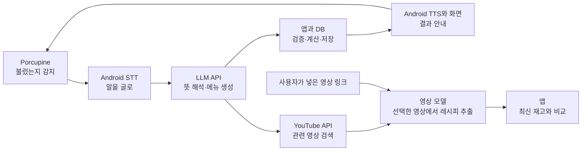

# 오늘 뭐 먹지? — 발표 스토리와 AI 개발 프로세스

작성일: 2026년 9월 28일 · 발표 7분 + 질의응답 3분 · 발표일 10/2 · 현재 상태: 실행 전 계획

> **이 문서는 10/1부터 작성한다.** 제출은 9/30 18:00이며 그때까지는 제품에만 시간을 쓴다.
> 아래 구성은 대략적인 초안이고, 실제 구현 결과가 나온 뒤 실측값·실제 화면으로 교체한다.

제품 기능과 설계 정책은 [서비스 기획서](proposal.md)가, 제공 범위는 [기능 범위](../scope/today-meal.md)가, 구조는 [아키텍처](../architecture/README.md)가, 일정은 [3일 실행 계획](../plan/hackathon-3day.md)이 기준이다. 이 문서는 발표 연출, 개발 역할 분담, UI/UX 제작, 문서 관리와 증거 수집 방식을 정의한다. 아직 제품 개발·성능 검증이 끝난 것으로 표현하지 않는다.

발표 매체는 HTML이다. GPT/Codex는 이야기·슬라이드 문구·대본·연출 지시를 작성하고, Claude가 실제 HTML을 제작한다. 구체적인 전달 내용은 [Claude HTML 제작 브리프](html-brief.md)를 따른다.

## 1. 발표에서 남길 한 문장

> **“장본 것을 말로 넣고, 쓴 것을 말로 빼고, 남은 것으로 오늘 저녁을 정합니다.”**

유튜브 기능을 연결하는 문장: **“영상에서 먹고 싶어진 요리를, 우리 집에서 만들 수 있는 요리로.”** 재료에서 메뉴·영상으로 가는 길과 영상에서 필요한 재료·냉장고로 오는 길을 보여준다.

부족한 재료는 쿠팡 검색으로 연결한다. 시연의 끝을 ‘재료가 없어요’에서 ‘필요한 재료를 바로 찾을 수 있어요’로 이어간다. 지금 요리할 메뉴와 구매 후 만들 메뉴는 구분한다.

발표의 주인공은 퇴근 후 요리하는 사용자다. 모델 이름과 구현 설명은 사용 경험의 이유를 설명할 때 등장한다. 청중이 공감할 주방의 상황에서 시작하고, 태블릿이 그 상황을 어떻게 바꾸는지 직접 보여준다.

AI 활용은 두 층으로 구분한다.

- **제품 안의 AI:** Porcupine 호출어 감지, Android 음성 입출력, Gemini의 자연어 해석·메뉴 생성·영상 레시피 추출. YouTube 검색은 검색 API가 담당한다.
- **제품을 만든 AI:** GPT를 활용한 기획·기술검토·스파이크, Claude를 활용한 구현, 모델과 사람이 함께 수행하는 화면 검토·검증.

GPT와 Claude의 역할은 개발자의 사용 경험과 작업 선호에 따른 초기 배치다. ‘GPT가 항상 더 빠르다’, ‘Claude가 모든 코드를 더 잘 짠다’ 같은 일반 성능 비교로 발표하지 않는다. 실제 사용한 모델·작업·산출물과 결과로 설명한다.

## 2. 권장 구성: 기능별 판단을 짧게 설명하고, 개발 과정은 뒤에서 묶기

시연 중에는 ‘왜 태블릿인가’, ‘왜 정정이 가능한가’ 같은 판단을 한 문장씩 연결한다. 이후 75초 동안 전체 개발 흐름과 AI 역할을 보여준다. 기술 설명 때문에 시연을 자주 멈추지 않는다.

| 슬라이드 | 시간 | 관객이 이해할 것 | 보여줄 것 |
|---|---|---|---|
| 1. 냉장고 앞의 고민 | 0:00~0:40 | 이 문제는 나도 겪는다 | 장본 식재료, 잊힌 재료, 저녁 메뉴 고민의 세 장면 |
| 2. 주방에 두는 AI 도우미 | 0:40~1:15 | 어떻게 쓰는 제품인지 알겠다 | 고정 태블릿 사진·실물과 세 가지 발화 |
| 3. 오늘 저녁까지 한 번에 | 1:15~3:35 | 실제로 동작하고 쓸 만하다 | 음성 재고 관리→메뉴·영상 추천→영상 재료 비교→쿠팡 검색 |
| 4. 이렇게 나눈 이유 | 3:35~4:20 | AI와 일반 코드의 역할이 납득된다 | 서비스 동작 그림 한 장 |
| 5. 3일 동안 어떻게 만들었나 | 4:20~5:35 | AI를 개발 과정에 어떻게 활용했는지 알겠다 | 기획→실험→화면→코드→검증과 실제 산출물 |
| 6. 어디까지 확인했나 | 5:35~6:20 | 결과를 믿을 수 있고 한계도 보인다 | 실측 결과 2~3개, 수정 전후 사례 하나 |
| 7. 다음 저녁에도 쓸까? | 6:20~7:00 | 누구에게 팔고 무엇을 검증할지 알겠다 | 초기 고객·반복 이용 검증·마무리 문장 |

시간은 합계 420초다. 아래 멘트는 대본 초안이며, 실제 구현과 리허설 결과에 맞춰 줄인다.

## 3. 슬라이드별 이야기와 멘트

### 슬라이드 1 — 냉장고 앞의 고민

**발표 멘트 초안**

> “퇴근하고 냉장고를 엽니다. 재료는 있는데, 오늘 뭘 만들지는 떠오르지 않습니다. 유튜브에서 맛있어 보이는 걸 찾으면 이번엔 재료가 있는지 다시 확인해야 합니다. 그렇다고 요리할 때마다 재고를 입력하기도 번거롭습니다. 말로 재료를 관리하고, 그 재료로 만들 저녁까지 연결해보려 했습니다.”

직접 겪은 경험이 있으면 실제 사례로 교체한다. 조사하지 않은 비율이나 음식물 낭비 수치를 넣지 않는다. 이 구간은 문제에 공감시키는 데 쓴다.

### 슬라이드 2 — 주방에 두는 AI 도우미

화면에는 아래 세 문장과 태블릿만 보여준다.

> “두부 두 모 넣었어.”
>
> “계란 두 개 썼어.”
>
> “오늘 뭐 먹지?”

**발표 멘트 초안**

> “주방에 안드로이드 태블릿 하나를 둡니다. 장본 것과 쓴 것을 말하면 냉장고 목록에 반영됩니다. 오늘 뭐 먹을지 물으면 재료에 맞는 메뉴와 따라 할 영상을 찾습니다. 반대로 유튜브 링크를 주면 그 요리에 필요한 재료가 우리 집에 있는지도 비교합니다.”

태블릿 선택의 이유는 ‘항상 같은 자리에 있고 손을 뻗어 휴대폰을 꺼낼 필요가 없다’는 사용 조건이다. 일상적인 발화에서도 정확히 반영되고 수정되는지 시연으로 이어간다.

### 슬라이드 3 — 오늘 저녁까지 한 번에

**하나의 주방 시나리오를 이어간다.** 기능 메뉴를 차례대로 둘러보는 방식보다 입력과 결과의 변화를 크게 보여준다.

시연 데이터 준비:

- **시연일 10월 2일 기준**으로 기한 데이터를 잡는다. 두부 소비기한 10/3은 시연 시점에 D-1이 되도록 맞춘다. 포장 기한을 모사한 데이터는 ‘시연용 데이터’라고 표시한다.
- 두부와 계란은 신규 등록 대상이다. 기본 양념 등은 실제 보유 설정에 미리 넣어둔다.
- 호출어는 모델 생성·실기기 검증을 마친 문구로 최종 통일한다.
- 앱 재고를 시연 초기 상태로 복구할 수 있는 개발용 절차를 준비한다. 일반 사용자 화면에 노출할 필요는 없다.

| 순서 | 사용자 발화 | 기대 화면·응답 | 관객에게 전달할 판단 |
|---|---|---|---|
| 1 | “헤이 냉장고, 두부 두 모랑 계란 열 개 넣었어. 두부 소비기한은 10월 3일이야. 둘 다 냉장실.” | 두 품목 등록, 두부 기한 표시, 계란 기한은 미확인 | 한 문장으로 여러 재료와 정보를 처리 |
| 2 | “헤이 냉장고, 계란 두 개 썼어.” | 계란 10→8개 | 요리 중에도 말로 기록 |
| 3 | “헤이 냉장고, 방금 계란 두 개가 아니라 세 개 썼어.” | 직전 사용량 수정, 계란 8→7개 | 사람의 정정 의도를 이해하고 기록을 고침 |
| 4 | “헤이 냉장고, 두부부터 쓸 메뉴 추천해줘. 영상도 찾아줘.” | 메뉴와 실제 유튜브 검색 결과 | 남은 재료에서 요리·영상으로 연결 |
| 5 | 검색된 영상 1개 선택 | 해당 영상의 재료와 냉장고 비교, 부족·미확인 재료 표시 | 먹고 싶은 요리와 만들 수 있는 요리의 차이 확인 |
| 6 | 부족한 재료의 ‘쿠팡에서 찾기’ 선택 | 해당 재료의 실제 쿠팡 검색 페이지 | 필요한 재료의 구매 준비까지 연결 |

각 구간에서 한 문장만 덧붙인다.

- 등록 후: “품목마다 입력창을 열지 않아도 됩니다.”
- 정정 후: “방금의 ‘세 개’는 추가 사용이 아니라 앞선 기록의 수정으로 처리했습니다.”
- 추천 후: “지금 남은 재료와 먼저 쓰려는 재료가 추천에 반영됩니다.”

시연 140초는 등록 25초, 사용·정정 25초, 메뉴·영상 검색 30초, 영상 재료 비교 30초, 쿠팡 검색 15초, 전환 여유 15초로 배정한다. 시간은 목표이며 실제 호출·응답 시간을 넣어 리허설한다. 링크 직접 입력은 같은 분석 화면으로 연결됨을 짧게 보여주고 설명한다. 검색 결과가 어떤 순서로 나올지는 고정하지 않는다.

영상 분석 지연은 별도로 측정한다. 발표에서는 사전에 실제로 분석한 영상의 저장 결과를 사용할 수 있으며 ‘사전 분석 결과’라고 표시한다. 저장된 분석 결과도 최신 냉장고와 대조한다. 처음부터 분석하는 짧은 실제 녹화본도 준비한다. 첫 분석 시간을 숨긴 채 즉시 분석이라고 말하지 않는다. 사용량 정정이 길어지면 해당 장면을 예비 영상으로 옮기고 영상 비교 흐름의 시간을 확보한다.

재료 비교 화면의 예시 멘트: “영상에는 버터가 필요한데 우리 냉장고에는 등록되어 있지 않습니다. 필요한 재료를 다시 적고 냉장고와 대조하는 일을 줄여줍니다.” 실제 시연 영상에서 확인한 재료로 문구를 교체한다.

구매 연결 멘트: “부족한 버터는 바로 쿠팡에서 찾을 수 있습니다. 필요한 양과 실제 살 포장은 구분해서 보고, 도착했을 때 말로 냉장고에 등록합니다.” 검색 연결만 구현한 경우 앱 내부 상품 추천이나 주문 연동을 구현했다고 말하지 않는다. 결제는 시연하지 않는다.

### 슬라이드 4 — 이렇게 나눈 이유

관객에게는 아래 구조를 단순한 아이콘·화살표로 보여준다.



**발표 멘트 초안**

> “기기에서는 Porcupine이 호출을 감지하고, 안드로이드가 음성을 입출력합니다. LLM은 말의 뜻과 메뉴를, 영상 모델은 영상 속 재료와 조리법을 해석합니다. 영상 검색은 YouTube API로 처리하고, 수량 계산과 냉장고 비교는 코드가 맡습니다. 그래서 검색된 영상과 재료까지 확인한 영상을 구분할 수 있습니다.”

발표 시 실제 앱에서 사용한 LLM 제공자·모델을 표시한다. 공급자별 라우팅을 구현하지 않았다면 멀티 모델 서비스로 소개하지 않는다. Android 내장 STT를 사용했다는 사실과 완전 오프라인 STT는 구분한다.

Porcupine 선택은 ‘한국어 호출어와 Android 연결을 빠르게 확보하고, 한정된 개발 시간을 제품 완성에 쓴다’는 판단이다. 콘솔에서 생성한 커스텀 모델을 자체 학습 모델로 표현하지 않는다. 기술 근거는 [서비스 기획서의 공식 문서 링크](proposal.md)에 정리한다.

### 슬라이드 5 — 3일 동안 어떻게 만들었나

아래 5단계를 한 장에 표시하고, 각 단계 아래 실제 파일·실험·화면 한 개씩을 배치한다.

`GPT로 기획·기술 실험 → UI/UX 기준과 화면 초안 → Claude로 기능 구현 → 태블릿 검증 → 문서·발표에 반영`

**개발 완료 후 사용할 멘트 초안**

> “AI는 서비스 안에서뿐 아니라 만드는 과정에도 활용했습니다. 기획과 기술 선택은 제가 빠르게 검토하는 데 익숙한 GPT로 진행했고, 애매한 기술은 작은 실험으로 먼저 확인했습니다. UI는 주방에서 멀리 봐도 읽히고, 손을 쓰지 않아도 상태를 알 수 있도록 화면 기준부터 정했습니다. 그 문서와 실행 조건을 Claude에 전달해 기능 단위로 구현했습니다. 결과는 실제 태블릿에서 확인하고, 수정 이유와 테스트 결과를 저장소에 남겼습니다.”

구현 전에는 ‘이렇게 진행할 계획’으로 설명한다. 실제 실행하지 않은 단계는 완료 후 대본에서 삭제한다. GPT가 만든 코드 스파이크와 Claude 구현의 경계를 굳이 엄격하게 나눌 필요는 없다. 산출물이 다음 단계에 어떤 정보를 전달했는지가 핵심이다.

### 슬라이드 6 — 어디까지 확인했나

실제 기록에서 다음 중 2~3개를 고른다.

- 지정 거리·소음 조건에서 호출 성공 `[성공 횟수 / 시도 횟수]`.
- 일반 대화 `[측정 시간]` 중 오호출 `[횟수]`.
- 정정·중복 요청·누락 보정 시나리오 `[통과 / 전체]`.
- 단순 명령의 응답 시간 중앙값 `[실측값]`과 측정 조건.
- 초기 화면과 태블릿 피드백을 반영한 최종 화면의 차이.

**결과 보고 멘트 틀**

> “완성 여부는 실제 태블릿에서 확인했습니다. [조건]에서 [결과]를 얻었습니다. 특히 [실제 실패 사례]가 있어 [수정 내용]을 적용했습니다. [아직 남은 제약]은 다음 사용자 테스트에서 확인할 계획입니다.”

가상의 실패 사례를 개발 경험처럼 꾸미지 않는다. 제품의 알려진 한계인 ‘말하지 않은 사용 내역까지 자동으로 알 수는 없음’은 현재 잔량 보정 기능과 함께 설명할 수 있다.

### 슬라이드 7 — 다음 저녁에도 쓸까?

**발표 멘트 초안**

> “첫 사용자는 집에서 자주 요리하고, 주방에 태블릿을 둘 수 있는 가구입니다. 다음에는 실제 가정에서 일주일간 사용해 음성 기록이 계속되는지, 추천한 메뉴를 실제로 만드는지 확인하려 합니다. 그 결과를 바탕으로 가족 공유와 유료 개인화 기능을 검증하겠습니다. 장본 것을 말로 넣고, 쓴 것을 말로 빼고, 남은 것으로 오늘 저녁을 정하는 서비스입니다.”

월 구독은 가설로만 제시한다. 이용자·결제·절약 실적이 생기기 전에는 수익성이나 절약 효과를 검증된 사실처럼 말하지 않는다.

사업화 설명에는 “개인화 구독과 함께, 실제 부족한 재료의 구매 연결에서 제휴 수익 가능성을 검증하겠습니다”를 추가할 수 있다. 일반 쿠팡 검색 링크와 파트너스 제휴 링크를 구분하고, 승인·제휴 조건을 확인하지 않은 수익률은 넣지 않는다.

## 4. 실제 개발에서 AI를 어떻게 나눠 쓸 것인가

| 단계 | 주 활용 도구 | 구체적인 작업 | 남겨야 하는 산출물 | 완료 판단 |
|---|---|---|---|---|
| 문제·범위 정의 | GPT + 개발자 | 사용자 상황, 필수 기능, 제외 범위, 예외 상황 정리 | 제품 기획서와 대표 발화 | 세 가지 핵심 경험과 완료 기준이 명확함 |
| 기술검토·스파이크 | GPT + 개발자 | 공식 문서 확인, 작은 실행 코드, 실패 조건 조사 | 실험 코드·실행 결과·선택 이유 | 실제 태블릿에서 위험한 연결을 확인 |
| UI/UX 설계 | GPT로 흐름·문구 초안, 개발자가 선택 | 상태 정의, 가로형 와이어프레임, 성공·오류 화면 | 화면 기준·선택한 시안·피드백 | 화면만 보고 현재 상태와 결과를 이해 |
| 본 구현 | Claude + 개발자 | 문서 기준으로 Android·서버를 기능 단위 구현 | 코드·검증 결과·관련 문서 변경 | 실제 사용자 흐름이 끝까지 동작 |
| 리뷰·수정 | GPT 또는 Claude + 개발자 | 변경 검토, 누락·재시도·상태 전환 확인 | 발견 문제·수정·재검증 기록 | 중요한 불변 조건과 화면 상태가 유지 |
| 발표 정리 | GPT + 개발자 | 실제 결과를 대본·그림·증거로 압축 | 발표안·영상·측정표 | 7분 리허설에서 핵심 경험 전달 |
| HTML 발표자료 | Claude + 개발자 | 확정된 문구·연출 지시로 슬라이드 제작 | HTML·로컬 자산·발표자 노트 | 실제 발표 브라우저에서 키보드 진행·영상·예비 화면 확인 |

개발자는 제품 범위, 사용자 경험, 최종 코드 검토와 실기기 판정을 책임진다. 모델의 자체 완료 보고만으로 완료 처리하지 않는다. 서로 다른 모델을 사용했다고 자동으로 독립 검증이 된 것으로도 간주하지 않는다.

## 5. 코딩 전에 끝낼 짧은 기술 실험

스파이크는 특정 위험 하나를 확인하는 최소 실험이다. 결과에 따라 본 구현 구조를 바꿀 수 있게 일찍 수행한다.

| 실험 | 확인할 질문 | 결과에 따른 결정 |
|---|---|---|
| Porcupine 호출 | 선택한 한국어 문구가 해당 태블릿에서 인식되는가? | 호출어·감도·거치 거리 결정 |
| 마이크 전환 | 감지기를 멈춘 뒤 내장 STT가 안정적으로 시작하는가? | 준비 신호음과 녹음 상태 전환 확정 |
| 한국어 STT/TTS | 수량·날짜를 인식하고 한국어 음성을 출력하는가? | 지원 모델·인식 엔진·후속 확인 UX 결정 |
| 명령 해석 | 사용·잔량 보정·정정·미래 계획을 구별하는가? | 명령 스키마와 확인 질문 설계 |
| 변경 무결성 | 같은 요청 재시도와 정정으로 중복 차감되지 않는가? | 명령 ID·변경 이벤트·취소 정책 검증 |
| 공개 영상 분석 | 링크 입력으로 한국어 레시피 재료·분량을 추출하는가? | 분석 API·미확인 처리·첫 분석 지연·저장 결과 재사용 결정 |
| 영상 검색·재고 대조 | 실제 검색 결과와 분석된 레시피를 최신 재고에 연결하는가? | 검색 카드 상태·단위 비교·실패 UX 결정 |
| 쿠팡 연결 | 한글 재료명으로 외부 검색이 열리고 앱으로 돌아오는가? | 검색 연결 확인, 파트너스 권한이 있는 경우에만 상품 카드 추가 |

시간은 첫날 초반에 2시간 안팎을 배정하는 계획으로 두고, 긴 학습·광범위한 모델 비교로 확대하지 않는다. 각 실험은 ‘질문 / 조건 / 실행 / 결과 / 결정 / 남은 문제’ 여섯 항목으로 기록한다. 아직 실행하지 않았으면 상태는 ‘미실행’이다.

GPT 활용 요청 예시:

> “안드로이드 태블릿에서 Porcupine 감지 후 SpeechRecognizer로 마이크를 넘기고 TTS 완료 뒤 재개하는 최소 실험을 설계해줘. 공식 문서 근거와 확인할 실패 조건을 정리하고, 실제 기기에서 판정할 항목을 제시해줘. 전체 앱은 아직 만들지 마.”

## 6. UI/UX는 어떻게 만들 것인가

### 먼저 정할 사용 조건

- 태블릿은 가로로 고정하고 조리 중 서 있는 위치에서 읽는다.
- 주 입력은 음성이며 터치는 보조다. 정상 흐름은 화면 조작 없이 완료되어야 한다.
- 응답은 한두 문장으로 읽고, 수량·기한·정정 결과는 큰 글자로 남긴다.
- 색만으로 상태를 구분하지 않고 문구·아이콘을 함께 쓴다.
- 소비기한, 기한 미확인, 재고 추정은 서로 다른 정보로 보여준다.
- 전체 발화 기록은 접어두고 최신 처리 결과를 우선한다.

### 화면을 그리기 전에 상태를 정의

`대기 → 호출 감지 → 듣는 중 → 처리 중 → 완료 / 확인 질문 / 오류 → 대기`

같은 화면 안에서 상태가 바뀌도록 구성해 사용자가 현재 위치를 잃지 않게 한다. 완료 시 ‘등록 완료’만 쓰지 않고 ‘계란 10개 → 8개’처럼 결과를 표시한다. 확인 질문은 한 번에 한 가지를 크게 보여준다.

가로형 대기 화면 초안:

```text
┌────────────────────────────────────────────────────────────┐
│ 오늘 뭐 먹지?                        호출 대기 중   [음소거] │
├───────────────────────────────────┬────────────────────────┤
│ 오늘 가능한 메뉴                  │ 먼저 쓸 재료           │
│                                   │ 두부 · 소비기한 10/03  │
│ 두부계란전  ·  2인분  ·  약 15분   │ 우유 · 개봉 9/30       │
│ 보유 재료: 두부, 계란…             │ 대파 · 잔량 확인 필요  │
│                                   │                        │
│ 다른 메뉴 1          다른 메뉴 2  │ 냉장고 보기            │
├───────────────────────────────────┴────────────────────────┤
│ “헤이 냉장고, 오늘 뭐 먹지?”                               │
│ 최근 변경: 계란 2개 사용 → 8개 남음            [되돌리기] │
└────────────────────────────────────────────────────────────┘
```

### 제작 흐름

1. GPT와 대기·듣기·성공·정정·오류 상태와 문구를 정리한다.
2. 한 화면에서 정보 배치가 다른 와이어프레임 2개를 만든다. 간단한 HTML이나 도식이면 충분하다.
3. 개발자가 실제 태블릿 크기에서 읽어보고 한 안을 선택한다. 색·간격·글자 크기·카드 규칙을 소수의 토큰으로 고정한다.
4. Claude에 선택한 구조와 상태 규칙을 전달해 Compose 화면을 구현하게 한다. 매 기능마다 전체 디자인을 다시 만들지 않는다.
5. 태블릿 스크린샷과 사용 영상을 보고 GPT 또는 Claude에 문제 후보를 찾게 한다. 실제 가독성·거리·소음에서의 인지는 사람이 확인한다.
6. 바뀐 화면 기준과 수정 이유를 문서에 반영하고 전후 이미지를 남긴다.

Figma는 협업·정교한 편집이 필요하면 선택한다. 이번 3일 일정에서는 코드로 만든 화면 초안과 Compose로도 진행 가능하다. 제품 사진·생성 이미지는 실제 구현할 필요가 있을 때만 추가하며, 상태와 결과가 읽히는 화면을 먼저 완성한다.

UI 요청 예시:

> “가로형 주방 태블릿 화면이다. 기본 입력은 음성이며 대기·듣기·확인 질문·성공·오류 상태를 한 화면에 표현해야 한다. 현재 메뉴와 먼저 쓸 재료가 가장 중요하다. 먼 거리에서 읽을 수 있는 배치 두 안을 제시하고, 글자·정보 밀도·상태 변화의 차이를 설명해줘.”

## 7. 설계와 문서 관리

### 채팅을 넘겨도 이어갈 수 있는 기준 만들기

문서 관리는 [engineering-system](https://github.com/pis-o-cake/engineering-system)의 계약을 따른다. 문서 유형과 필수 절은 그 표준이 정하고, 경로별 유형 배정은 `.engsys/project.yaml`이 갖는다. 아래 표는 이 프로젝트의 실제 배치다.

| 경로 | 유형 | 담을 내용 | 갱신 시점 |
|---|---|---|---|
| `docs/scope/today-meal.md` | project-scope | 필수·추가·후속 기능과 기능별 완료 기준 | 범위가 바뀔 때 |
| `docs/design/` | design-proposal | 기술 선택의 근거·버린 대안, 데이터 모델 | 설계 동결 전까지 |
| `docs/architecture/README.md` | architecture | 구성요소·책임·주요 흐름·정본 위치 | 책임 경계나 정본이 옮겨질 때 |
| `docs/plan/hackathon-3day.md` | work-plan | 슬라이스 작업표·상태·장애 요인 | 슬라이스가 끝날 때마다 |
| `docs/adr/` | decision-record | **설계 동결 뒤** 무엇이 왜 바뀌었는가 | 동결된 선택을 뒤집을 때 |
| `docs/verification/` | verification-spec | 검증 항목과 판정 기준 | 검증 기준이 정해질 때 |
| `docs/product/` | (검사 제외) | 기획서·발표 계획·HTML 브리프 | 제품 정책이 바뀔 때 |

구조 검사는 `engsys docs check`가 하고 커밋 규약은 `commit-msg` 훅이 막는다. 3일 일정을 고려해
`pre-push` 게이트와 개별 문서 편집 검토는 켜지 않았다 — push가 문서 리뷰 기록 때문에 막히지
않게 한 선택이며, 일정이 끝난 뒤 켠다.

문서와 코드는 같은 Git 저장소에서 관리한다. 모든 대화를 복사하지 않고 결정·계약·진행 상태만 요약한다. API 스키마·데이터 타입처럼 코드가 기준인 정보는 해당 파일을 링크하고, 설명 문서에 서로 다른 복사본을 만들지 않는다.

### 기능 하나를 완료하는 단위

1. 제품 문서에서 요구와 완료 기준을 확인한다.
2. 바뀌는 API·데이터·화면 규칙이 있으면 먼저 설계에 반영한다.
3. Claude에 기능 하나와 해당 문서·파일을 전달한다.
4. 구현 후 중요한 동작을 테스트하고 해당 태블릿 흐름을 확인한다.
5. 결과를 검증 문서에 남기고, 코드·관련 문서를 같은 변경 묶음으로 커밋한다.
6. 진행 문서에 완료 내용·남은 문제·다음 시작점을 갱신한다.

모든 스타일 수정마다 별도 문서를 쓰지 않는다. 동작·계약·제품 판단에 영향이 있는 변경을 기록한다. 커밋 한 개의 기준도 작은 CSS/색상 변경보다 설명 가능한 기능이나 수정 단위로 둔다.

### 모델 간 전달 예시

GPT에서 Claude로 전달할 내용:

> “`docs/product.md`, `docs/design.md`, `docs/progress.md`를 먼저 읽어라. 이번 작업은 ‘사용량 정정’이다. ‘계란 2개 썼어’ 뒤 ‘3개가 아니라 4개’가 오면 직전 대상과 발화를 확인해 처리해야 한다. 현재 구현과 문서 기준이 충돌하면 차이를 밝히고 해결안을 제시해라. unrelated 화면·기능은 변경하지 말고, 검증 결과와 다음 작업을 남겨라.”

실제 정정 수량이 자연스러운 테스트는 ‘2개 사용 → 아니, 3개’로 준비하고, 잘못된 참조가 섞인 발화는 재질문을 검증하는 별도 사례로 둔다.

구현에서 리뷰로 전달할 내용:

> “이 변경은 음성 사용량 정정을 추가했다. 관련 문서와 diff, 실행한 검증 결과를 기준으로 중복 차감·잘못된 대상 선택·부분 실패·되돌리기 문제를 확인해라. 실행하지 않은 검증은 실행했다고 표현하지 말고 미확인으로 남겨라.”

### 완료의 의미

‘코드 작성’, ‘빌드 성공’, ‘시나리오 검증’, ‘실기기 확인’을 구분해 기록한다. 핵심 기능은 실기기 확인까지 끝나야 발표의 라이브 시연 대상으로 올린다. AI가 수정했다고 설명한 것과 실제 파일·실행 결과가 일치하는지 개발자가 확인한다.

## 8. 발표를 위해 개발 중 남길 증거

발표 전날 대화 기록을 모두 다시 찾지 않도록 다음 정도만 저장한다.

| 증거 | 담을 내용 | 발표에서 쓰는 위치 |
|---|---|---|
| 기획 초안→최종 범위 | 재고 입력 부담을 음성으로 줄이기로 한 결정 | 개발 과정 |
| 기술 실험 1개 | 실제 태블릿 호출어·마이크 전환의 조건과 결과 | 설계 이유·개발 과정 |
| 화면 전후 1쌍 | 가독성·음성 상태·정정 결과 개선 | UI/UX 설명 |
| 대표 구현 변경 1개 | 자연어 정정이 재고 이벤트에 반영되는 코드와 검증 | AI 개발 활용 |
| 실제 실패→수정 1개 | 발생 상황·원인·수정·재검증 | 검증 결과 |
| 최종 사용 영상 | 등록→사용→정정→메뉴·영상 추천→재료 비교, 첫 영상 분석 시간 | 시연 예비 자료 |

모델 사용 기록은 작업명·실제 모델명·요청 요약·산출물 경로·채택한 수정·검증 결과 정도로 남긴다. 토큰·시간·비용을 측정했다면 함께 기록하되, 비교 대조가 없으면 ‘개발 시간을 몇 % 줄였다’는 인과 효과를 주장하지 않는다.

## 9. 3일 동안 실행할 순서

슬라이스 단위 작업표와 장애 요인의 정본은 [3일 실행 계획](../plan/hackathon-3day.md)이다. 아래는 발표에 남길 것을 함께 보기 위한 요약이다.

| 일자 | 제품 작업 | AI 활용·문서 작업 | 발표에 남길 것 |
|---|---|---|---|
| 1일 차 | Porcupine→내장 STT/TTS, 음성 등록·조회, 영상 분석·검색 실험 | GPT로 스파이크·계약·화면 초안, Claude로 첫 기능 흐름 구현 | 기술 선택 근거·초기 화면·실행 영상 |
| 2일 차 | 기한·사용량·정정·메뉴 추천, 영상 재료 비교·검색·쿠팡 연결 | Claude로 기능 완성, GPT/Claude로 리뷰, 개발자가 실기기 검증 | 수정 사례·화면 전후·검증 결과 |
| 3일 차 | 기한 카드·대시보드·APK·서버 배포 → **18:00 제출** | 발표 자료는 만들지 않음 | 제출 시점 실기기 영상 |
| 예비 10/1 | 버그 수정, 여유 시 추가 슬라이스 | 실제 결과로 대본 갱신, Claude로 HTML 제작 | 실측값·화면 전후·녹화본 |
| 시연 10/2 | — | 발표 브라우저 리허설 | 7분 리허설 |

발표 **자료 제작**은 10/1에 시작하지만, 발표에 쓸 **증거**는 첫날부터 모은다. 화면 캡처와 실기기 영상을 슬라이스마다 남겨두면 10/1에 새로 찍지 않아도 된다. 최종 리허설은 API 지연과 음성 응답까지 포함한다.

## 10. 예상 질문과 답변 기준

| 질문 | 답변의 중심 |
|---|---|
| “그냥 일반 AI에 메뉴 물어보면 되지 않나요?” | 집의 재고·기한·사용·정정이 지속적으로 연결되고 주방에서 호출만으로 접근한다는 점 |
| “말 안 하고 재료를 쓰면 틀리잖아요?” | 맞는 한계다. 현재 잔량 보정과 필요한 재료만 확인하는 흐름으로 복구하며 실제 누락 빈도는 사용자 테스트로 측정 |
| “왜 모델을 직접 학습하지 않았나요?” | Porcupine의 커스텀 호출어·Android SDK를 활용해 제품 경험 완성에 시간을 썼다는 선택 |
| “왜 GPT와 Claude를 나눠 썼나요?” | 본인 작업 경험에 맞춰 기획·스파이크와 구현을 배치. 실제 산출물과 검증으로 설명 |
| “UI도 AI가 만들었나요?” | AI가 만든 흐름·시안·코드와 사람이 선택·수정·실기기 확인한 부분을 구체적으로 구분 |
| “개발용 AI와 제품용 AI가 같은 건가요?” | 개발 단계의 도구와 실행 중 API는 별도다. 실제 사용한 모델을 각각 표시 |
| “유튜브 링크만 주면 아무 영상이나 되나요?” | MVP는 지원되는 공개 요리 영상 대상. 추출되지 않은 수량은 미확인으로 남기고, 실패 시 분석한 척하지 않음 |
| “추천 영상은 전부 지금 만들 수 있나요?” | 검색은 관련 영상 제시. 영상의 실제 재료를 분석하고 재고와 대조한 후 준비 가능 여부를 표시 |
| “쿠팡과 어디까지 연동했나요?” | MVP는 부족한 재료별 검색 페이지 연결. 상품 API·제휴 링크·주문 연동은 실제 구현한 범위만 설명 |
| “항상 음성을 서버에 보내나요?” | 호출어 대기는 기기 내 처리. 명령은 Android 인식 서비스 정책에 따라 처리하고 앱 서버에는 텍스트를 전달 |
| “소비기한이 맞다는 보장은요?” | 사용자·라벨의 날짜와 종류를 관리하고 미확인 정보는 미확인으로 유지. 안전 판정이나 기한 자동 연장 기능으로 설명하지 않음 |
| “돈을 낼까요?” | 아직 가설. 일주일 실제 사용·추천 요리 실행·결제 의사를 순서대로 확인 |

## 11. 발표 직전 확정할 것

- 실제 호출어, 제품용 LLM, 개발에 사용한 모델명과 역할.
- APK와 서버의 동일한 릴리스 버전, 태블릿 권한·음성 데이터·음량·거치 위치.
- 시연용 재고 초기값과 날짜, 정정 전후 기대값, 메뉴의 보유 재료.
- 실제 유튜브 원본 링크·재료 검토 결과·분석 지연. 저장된 분석 결과·녹화본·라이브를 각각 표시.
- 실측 결과와 출처 파일. 미측정 항목은 발표 수치에서 제외.
- 라이브 시연이 지연될 때 전환할 짧은 영상과 설명.
- 개발 완료 후 대본의 계획형 문장을 실제 수행 내용으로 교체했는지 여부.

발표의 결론은 제품 가치와 개발 방식이 함께 남도록 한다. **“주방에서 이어지는 작은 대화를 서비스로 만들고, AI와 함께 기획·실험·구현·검증을 연결했다.”**
