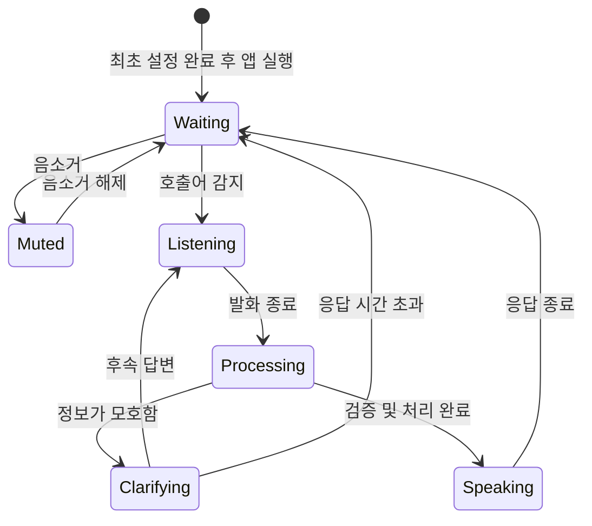
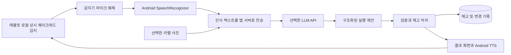

# 오늘 뭐 먹지? — 주방 태블릿에 말로 관리하는 우리 집 냉장고

서비스 기획서 v0.8 · 2026년 9월 28일 · 개발 9/28~9/30 · 제출 9/30 18:00 · 시연 10/2

선택: Porcupine 웨이크워드 / 안드로이드 내장 STT·TTS / Gemini 단일 연결부 / FastAPI 서버 + Android MVVM / PostgreSQL 16

위 선택은 [기술 설계](../design/0001-mvp-technical-design.md)에 근거와 함께 있으며 아직 `draft`다. 실기기 스파이크 전까지 확정이 아니다.

이 문서는 **제품 기능과 설계 정책**의 기준이다. 실행에 쓰는 정본은 따로 있다.

| 알고 싶은 것 | 정본 |
|---|---|
| 무엇을 만들고 어디까지 하면 완료인가 | [기능 범위](../scope/today-meal.md) |
| 어떤 구조로 만드는가 | [아키텍처](../architecture/README.md) |
| 테이블과 컬럼이 어떻게 생겼는가 | [데이터 모델 설계](../design/0002-database.md) |
| 어떤 순서로 언제까지 만드는가 | [3일 실행 계획](../plan/hackathon-3day.md) |
| 기술 선택을 왜 그렇게 했는가 | [ADR](../adr) |
| 발표를 어떻게 하는가 | [발표 및 AI 개발 프로세스](presentation-plan.md) |

범위가 이 문서와 기능 범위 문서에서 어긋나면 **기능 범위 문서가 이긴다.** 이 문서는 정책을 갖고 범위는 갖지 않는다.

> “헤이 냉장고, 두부 두 모 넣었어. 소비기한은 10월 3일이야.”
>
> 장본 재료와 사용한 재료를 말로 기록하고, 먼저 먹어야 할 재료로 오늘의 메뉴를 정한다.

## 1. 서비스 요약

‘오늘 뭐 먹지?’는 주방에 고정해 둔 안드로이드 태블릿을 웨이크워드로 호출하는 가정용 AI 주방 도우미다. 태블릿은 상시 전원에 연결하고 전용 앱 화면을 유지한다. 사용자는 별도로 휴대폰을 꺼내거나 매번 앱을 여는 과정 없이 말을 걸어 식재료를 등록하고, 사용량과 개봉일을 반영하고, 현재 재료에 맞는 메뉴를 추천받는다.

웨이크워드 감지는 태블릿에서 상시 처리한다. 대기 중에는 STT를 실행하거나 LLM API를 호출하지 않는다. 호출 후 Android SpeechRecognizer로 명령을 텍스트로 바꾸고, 선택한 LLM API가 자연어의 의도와 식재료 정보를 해석한다. 응답은 Android TextToSpeech로 읽고 자동으로 웨이크워드 대기로 돌아간다. LLM 제공자는 특정하지 않는다. 실제 재고 변경과 날짜 계산은 애플리케이션이 검증 후 실행한다.

핵심 가치는 세 가지다.

- **입력을 줄인다:** 손으로 항목을 채우는 대신 여러 재료를 한 문장으로 등록한다.
- **재료를 잊지 않게 한다:** 표시기한·개봉일·보관 위치와 잔량을 함께 관리한다.
- **식사를 결정해 준다:** 보유 재료, 먼저 쓸 재료, 인분과 조리 시간을 반영한 메뉴·조리법을 만든다.

유튜브 레시피도 냉장고와 연결한다. 보고 싶은 영상 링크를 넣으면 필요한 재료와 부족한 재료를 알려주고, 보유 재료로 메뉴를 추천할 때는 관련 유튜브 영상을 함께 찾는다. 핵심은 **먹고 싶은 요리와 지금 만들 수 있는 요리를 연결하는 것**이다.

부족한 재료는 장보기 목록으로 모으고 쿠팡 검색으로 연결한다. ‘영상에서 발견 → 우리 집 재고 확인 → 부족한 재료 구매 → 도착 후 등록’까지 이어지는 경험을 만든다.

이 문서의 서비스명·호출어·가격·성능 수치는 기획 가설 또는 검증 목표다. API 계정, 호출어 모델, 기기별 동작은 개발 첫날 확인한다.

## 2. 대상 사용자와 해결할 문제

초기 대상은 주 3회 이상 집에서 요리하며 장보기와 식사 준비를 직접 하는 1~2인 가구다. 가족 공유는 후속 확장으로 둔다.

| 사용자 상황 | 현재의 불편 | 서비스가 제공할 결과 |
|---|---|---|
| 장을 보고 정리하는 중 | 품목·수량·기한을 일일이 입력하기 번거롭다 | 한 문장으로 여러 재료 등록 |
| 조리 중 손이 젖거나 더러움 | 앱을 열어 사용량을 기록하기 어렵다 | 호출 후 사용량을 말해 반영 |
| 냉장고에 무엇이 있는지 기억나지 않음 | 같은 재료를 다시 사거나 안쪽 재료를 놓친다 | 음성 조회와 먼저 쓸 재료 목록 |
| 퇴근 후 저녁 준비 | 재료는 있지만 메뉴가 떠오르지 않는다 | 지금 가능한 메뉴 3개와 선택 이유 |
| 며칠 동안 기록하지 않음 | 재고가 틀어져 앱을 포기한다 | 필요한 재료만 확인하고 현재 상태로 보정 |

제품의 첫 화면은 재고 입력 폼보다 ‘오늘 가능한 메뉴’와 ‘먼저 쓸 재료’를 우선한다. 관리 행동이 바로 식사 결정에 도움이 되도록 설계한다.

## 3. 대표 사용 경험

### 3.1 장본 재료를 넣을 때

1. 최초 설치 때 마이크 권한과 음성 출력 등을 설정한 뒤, 태블릿을 주방에 거치해 상시 대기시킨다. 일상 사용에서는 시작 버튼을 누르지 않는다.
2. “헤이 냉장고.”라는 호출어에 짧은 소리와 화면 표시로 응답한다.
3. 사용자가 “두부 두 모랑 계란 열 개 넣었어. 두부는 소비기한이 10월 3일까지야. 둘 다 냉장실.”이라고 말한다.
4. 앱은 두부와 계란을 별도 항목으로 만든다. 두부의 표시기한만 저장하고 계란의 기한은 미확인으로 둔다.
5. “두부 2모, 계란 10개 등록했어요. 두부 소비기한은 10월 3일이에요.”라고 짧게 알려준다.

명확한 명령은 재확인을 반복하지 않고 반영한다. 애매한 정보만 질문하며, 모든 변경은 화면에 표시하고 되돌릴 수 있다.

### 3.2 요리하며 재료를 사용할 때

> 사용자: “헤이 냉장고, 계란 두 개랑 두부 반 모 썼어.”
>
> 앱: “계란 8개, 두부 1모 반 남았어요.”
>
> 사용자: “아니, 계란은 세 개 썼어.”
>
> 앱: “방금 사용량을 3개로 고쳤어요. 계란 7개 남았어요.”

정정은 기존 명령을 수정한다. 계란 3개를 추가로 차감하지 않는다. 단, 초기 수량도 추정치였다면 남은 양 역시 ‘추정’으로 표시한다.

### 3.3 오늘 메뉴를 정할 때

> 사용자: “헤이 냉장고, 오늘 뭐 먹지? 두 명이고 15분 안에 되는 걸로.”
>
> 앱: “먼저 쓸 두부와 계란으로 두부계란전을 추천해요. 두부덮밥도 가능해요. 조리법 알려드릴까요?”
>
> 사용자: “두부계란전으로. 파는 다 먹었어.”
>
> 앱: “파는 없는 것으로 바꿨어요. 파 없이 만드는 2인분 조리법을 보여드릴게요.”

메뉴 조회·선택만으로 재료를 차감하지 않는다. 실제로 만들었다는 확인이나 명시적인 사용 명령이 있을 때 반영한다.

### 3.4 장보기·사용 기록을 놓쳤을 때

> 사용자: “헤이 냉장고, 계란 지금 네 개 남았어.”
>
> 앱: “현재 잔량을 4개로 맞췄어요.”

‘4개 썼다’와 ‘4개 남았다’를 구분한다. 누락한 과거 기록을 전부 요구하지 않고 현재 잔량으로 복구한다.

### 3.5 유튜브에서 본 요리가 먹고 싶을 때

1. 태블릿에서 유튜브 링크를 붙여 넣는다. Android 공유 받기는 여유가 있을 때 추가한다. 긴 URL을 음성으로 읽게 하지 않는다.
2. 공개 영상에서 요리명·인분·재료·수량·조리 순서를 추출하고 원본 링크를 남긴다.
3. 냉장고와 대조해 ‘보유 / 부족 / 수량 확인 필요’를 보여준다.
4. “이 영상은 버터가 필요한데, 등록된 재고에는 없어요.”처럼 차이를 짧게 설명한다.
5. “버터 없이 할 수 있어?”라고 물으면 가능한 경우 AI가 조정안을 제공한다. 원본 조리법과 달라지는 점을 표시한다.

위 발화는 UX 예시이며 특정 영상을 분석한 결과가 아니다. 영상에 없는 분량은 미확인으로 남긴다. 분석·저장·영상 시청만으로 재료를 등록하거나 차감하지 않는다.

### 3.6 냉장고 재료로 따라 할 영상을 찾을 때

> 사용자: “헤이 냉장고, 두부랑 계란으로 뭐 해 먹지? 영상도 찾아줘.”

앱이 재고에 맞는 메뉴를 제시하고 관련 유튜브 영상 카드까지 보여준다. 선택한 영상의 실제 재료를 분석한 뒤 보유 여부를 다시 비교한다. 메뉴가 가능한 것과 검색된 영상의 조리법이 그대로 가능한 것은 구분한다.

### 3.7 영상 요리에 부족한 재료를 살 때

> 사용자: “이 영상 만들려면 없는 재료 쿠팡에서 찾아줘.”
>
> 앱: “등록된 재고에는 버터가 없어요. 필요한 양은 20g이에요. 쿠팡 검색 버튼을 보여드릴게요.”

위는 가상 레시피 예시다. 실제 영상 분석에서 확인한 재료·분량으로 응답한다. 사용자가 구매 검색을 요청한 경우에는 확인 질문을 반복하지 않고 부족한 재료 카드와 ‘쿠팡에서 찾기’를 제공한다. 양이 불확실한 항목은 먼저 확인할 수 있게 표시한다.

쿠팡에서 상품 선택·결제를 마친 뒤에도 앱 재고는 그대로다. 상품이 도착하면 “버터 200g 왔어”라는 음성 등록으로 연결한다. 주문·배송 상태 자동 연동은 MVP 범위에 포함하지 않는다.

## 4. 음성 인터페이스 설계

### 호출어와 상시 대기

- 가칭 호출어는 **‘헤이 냉장고’**로 두고 실제 인식 시험 후 확정한다.
- 최초 설정 후 기본 상태는 상시 웨이크워드 대기다. 대화할 때마다 주방 모드를 켜는 과정은 없다.
- MVP의 주 사용 기기는 주방에 고정한 안드로이드 태블릿 한 대다. 안드로이드 앱으로 설치하고, 해당 태블릿에서 긴 시간 대기와 반복 호출을 검증한다.
- 상시 전원과 전용 앱 화면 유지를 기본 운영 조건으로 둔다. 대기 화면은 낮은 밝기의 냉장고 대시보드로 제공한다.
- 상시 대기는 로컬 호출어 감지다. 클라우드 음성 대화를 하루 종일 유지하지 않는다.
- 앱이 종료되거나 마이크 권한이 해제되면 대기 중으로 표시하지 않는다. 음소거·대기 복구 상태를 확인할 수 있게 한다.
- 마이크 버튼과 텍스트 입력을 보조 경로로 제공한다. 웨이크워드는 MVP의 필수 검증 항목으로 유지한다.

웨이크워드 엔진은 **Porcupine Android SDK로 확정**한다. 한국어 커스텀 호출어와 Android SDK를 활용하고, 3일 동안 재고 관리·메뉴 추천 경험을 완성하는 데 시간을 배분하기 위한 선택이다. openWakeWord·microWakeWord의 직접 학습 경로는 검토했으나 이번 구현 범위에는 넣지 않는다.

Porcupine 콘솔에서 호출어 모델을 생성해 기기에 배포한다. 이를 자체 데이터로 웨이크워드 모델을 직접 학습한 것으로 소개하지 않는다. 특정 호출어의 인식률, 계정·라이선스·배포 조건은 실제로 확인한다. 고정 태블릿의 전용 화면에서 상시 감지하며, 잠금·백그라운드 동작이 필요해질 경우 별도 검증한다. [Porcupine 공식 FAQ](https://picovoice.ai/docs/faq/porcupine/), [커스텀 호출어 생성 안내](https://picovoice.ai/blog/console-tutorial-custom-wake-word/), [Android SDK](https://picovoice.ai/docs/quick-start/porcupine-android/)

화면 유지는 호출어 감지와 별개의 기기 운영 설정이다. 안드로이드 Activity에 `FLAG_KEEP_SCREEN_ON`을 적용해 전경 화면을 유지한다. 낮은 밝기의 대시보드는 앱 내부 대기 화면이며 운영체제의 잠금 화면과 구분한다. 재부팅·강제 종료 후에는 MVP에서 앱을 다시 실행해야 하며, 부팅 자동 실행과 기기 전체 키오스크 관리는 후속 범위다. [Android 화면 유지 안내](https://developer.android.com/develop/background-work/background-tasks/awake/screen-on)

### 음성 처리 상태

- 마이크 활성화와 클라우드 전송 상태를 화면에서 구분한다.
- 호출 직후 짧은 신호음을 주고 명령을 받는다. MVP는 신호음 후 발화하는 방식으로 검증한다.
- 발화 종료는 Android 인식 서비스의 콜백을 기준으로 처리한다. 별도로 명령 세션 최대 20초의 앱 타임아웃을 초기 설정안으로 둔다. 무음 종료 시간 설정은 인식 서비스별 지원을 확인하며, 동일한 동작을 가정하지 않는다.
- 재질문 중에는 짧은 후속 응답 창을 열어 호출어를 반복하지 않아도 답할 수 있게 한다. 초기 설정안은 10초다.
- 음성 응답 재생 중에는 재고 변경용 명령 인식을 멈춰 자기 응답을 다시 명령으로 처리하지 않게 한다.
- 확인되지 않은 임시 변경은 응답 시간 초과 시 적용하지 않는다.

안드로이드 마이크 권한은 최초 설정에서 요청하고, 서버와의 통신은 HTTPS로 구성한다. 호출어 감지기가 마이크를 해제한 뒤 SpeechRecognizer를 시작한다. 준비 콜백 후 신호음을 주고 명령을 받으며, 최종 결과 또는 오류 콜백 이후 자원을 정리한다. TTS 재생 완료 또는 오류 뒤 호출어 감지를 다시 시작한다. 통화·다른 앱·권한 변경으로 오디오가 중단되면 실제 상태를 표시하고 전경 복귀 시 복구를 시도한다.

Android 내장 인식 서비스가 항상 기기 내에서 처리되는 것은 아니다. `isRecognitionAvailable`로 기본 서비스를, 지원 OS에서는 `isOnDeviceRecognitionAvailable`로 온디바이스 엔진을 확인하고 한국어 모델 지원도 별도로 점검한다. 내장 서비스는 호출 이후 짧은 명령에 사용하며 상시 전사에 사용하지 않는다. [Android SpeechRecognizer 공식 문서](https://developer.android.com/reference/android/speech/SpeechRecognizer)

## 5. 재료 등록과 기한 관리

### 5.1 음성을 기본 입력으로

| 발화 | 해석·처리 |
|---|---|
| “양파 세 개, 계란 열 개 샀어” | 현재 집에 넣는 맥락인지 확인된 경우 두 품목 입고 |
| “내일 양파 세 개 살 거야” | 미래 구매 계획으로 해석하며 현재 재고에 추가하지 않음 |
| “두부 두 모, 소비기한 10월 3일, 냉장실” | 품목·수량·기한 종류·날짜·위치 저장 |
| “두부는 3일까지야” | 현재 월·연도와 기한 종류가 불분명하면 필요한 부분만 질문 |
| “아까 넣은 두부 하나는 5일까지네” | 해당 입고를 서로 다른 기한의 두 묶음으로 분리 |
| “우유 오늘 열었어” | 개봉일 기록 |
| “고기 반은 냉동실로 옮겼어” | 원래 재고를 나눠 보관 위치와 이동 시점 기록 |
| “두부 날짜는 모르겠어” | 기한 미확인 상태로 등록 허용 |

복합 발화에서 일부 항목이 모호하면 전체를 초안으로 잡고 필요한 질문을 한다. 명확한 항목만 먼저 반영하는 경우에는 완료 항목과 미완료 항목을 분명히 구분해 안내한다.

### 5.2 사진은 날짜를 읽는 보조 수단

이름·수량은 말하고, 읽기 번거로운 포장 날짜는 사진으로 전달할 수 있다. 제품과 날짜 부분이 연결되도록 현재 대화에서 대상을 지정한다.

> “이 두부 날짜 좀 읽어줘.” → 라벨 사진 촬영 → 날짜 종류와 날짜 추출 → 원문 부분과 함께 확인 → 저장.

MVP에서는 단일 제품의 라벨 사진을 지원한다. 다수 제품을 동영상으로 추적하는 기능, 영수증 대량 등록, AR은 후속 기능이다. OCR이 읽지 못한 날짜를 LLM이 보충해서 만들지 않는다. 사진의 외형만으로 식품의 안전 상태도 판정하지 않는다.

일반 EAN/UPC 바코드는 제품 식별용이므로 개별 포장 기한을 제공하지 않는다. 일부 GS1 2D 코드는 기한을 포함할 수 있다. 바코드만으로 소비기한을 자동 완성하는 기능은 전제하지 않는다. [GS1 바코드 안내](https://www.gs1.org/standards/get-barcodes), [GS1 2D 기한 필드](https://ref.gs1.org/guidelines/2d-in-retail/)

### 5.3 날짜별 의미를 보존

| 관리 값 | 정책 |
|---|---|
| 표시기한 | 소비기한·유통기한·품질유지기한 등 원래 종류와 날짜를 함께 저장 |
| 제조일·포장일 | 표시기한과 구분하며 임의로 소비기한으로 변환하지 않음 |
| 구매일·입고일 | 음성·영수증·등록 시점 중 출처를 남김 |
| 개봉일·소분일 | 별도 이벤트로 저장하고 라벨의 개봉 후 안내와 함께 관리 |
| 보관 위치·상태 | 냉장·냉동·실온·모름을 구분, 실제 온도 측정값으로 취급하지 않음 |
| 점검 알림일 | 표시 날짜가 없는 재료에 설정. 소비기한이나 안전 보증으로 표현하지 않음 |

같은 두부라도 기한·개봉 상태가 다른 팩은 별도 묶음으로 관리한다. 냉동 전환이나 소분을 이유로 원래 기한을 자동 연장하지 않는다. 개봉 후 보관 지침은 제품 표시를 우선한다. 소분·개봉 기록의 실무 예시는 공식 식재료 관리 자료를 참고한다. [식재료 관리 안내](https://www.schoolhealth.kr/resource/editRes/20240711/22CEBDCA23AC40EEB7B2800614DEA07F.pdf)

### 5.4 알림은 메뉴 추천으로 연결

- 태블릿 대기 대시보드에 먼저 확인할 재료를 계속 표시하고, 날짜가 바뀌거나 재고가 수정되면 갱신한다.
- 표시기한 알림은 사용자 설정에 따라 D-3·D-1·당일 등의 일정으로 계산한다. 이는 초기 UX 설정안이다.
- 소비기한이 지난 항목은 일반적인 ‘오늘 요리할 재료’ 후보에서 제외하고 별도 확인 대상으로 둔다.
- 기한 종류나 보관 이력이 불명확한 재료는 안전하다고 단정하지 않는다.
- “두부 기한이 가까워요”와 함께 해당 두부를 쓰는 메뉴를 제안한다.
- MVP 알림은 상시 켜진 태블릿 화면의 기한 카드와 사용자 질문에 대한 음성 응답이다. 가족의 휴대폰으로 보내는 푸시는 후속 범위다.

## 6. 사용량·누락·정정 처리

### 기본 원칙

정확히 말한 사용량과 레시피로 추정한 사용량을 구분한다. 현재 잔량이 불확실하다는 이유만으로 사용을 막거나 숫자를 지어내지 않는다.

| 상황 | 처리 |
|---|---|
| “계란 두 개 썼어” | 확인된 사용 이벤트. 기존 잔량이 정확하면 계산 결과도 정확한 값으로 표시 |
| “계란 네 개 남았어” | 현재 잔량을 4개로 맞추는 보정 이벤트 |
| “대파 조금 썼어” | 정성적 사용 기록. 임의의 g 단위로 바꾸지 않음 |
| “볶음밥 해먹었어” | 직전에 선택한 레시피가 있으면 사용량 추정안을 제시하고 확인 후 반영 |
| 메뉴만 조회하거나 조리 시작 | 실제 사용량으로 확정하지 않음 |
| “방금 거 취소” | 직전 변경 묶음을 되돌리고 결과 안내 |
| “두 개가 아니라 세 개” | 직전 관련 사용량을 교체, 중복 차감 금지 |
| 같은 제품이 여러 팩 | 개봉·기한 정보로 후보를 좁힘. 대상이 불분명하면 질문 |
| 사용량이 기록된 잔량보다 많음 | 음수 재고를 저장하지 않고 현재 잔량 확인 |
| 재료를 가족이 사용했으나 기록하지 않음 | 다음 추천 시 필요한 재료만 질문하거나 현재 사진·음성으로 보정 |

‘반’은 남은 양의 절반인지 한 포장의 절반인지 구분해야 한다. “두부 반 모”처럼 단위가 명시되면 처리하고, “반 썼어”처럼 기준이 불명확하면 짧게 묻는다.

남은 음식은 후속 기능으로 관리한다. 조리 때 원재료를 차감하고 남은 요리를 별도 항목으로 등록하며, 남은 요리를 먹을 때 원재료를 다시 차감하지 않는다.

음성 입력은 기록 부담을 줄이지만 누락을 제거하지 않는다. 마지막 확인 시점과 수량의 확실성을 유지하고, 추천 결과에 영향을 주는 불확실한 재료만 1~2개 확인하는 흐름을 기본 복구 수단으로 둔다.

## 7. 메뉴 추천과 생성형 AI의 역할

추천 입력은 실제 재고, 재료의 기한·개봉 상태, 인분, 조리 가능 시간, 보유 도구, 기피 재료와 최근 메뉴다. 기본 양념도 사용자가 보유한다고 설정한 것만 보유 재료로 취급한다.

추천은 다음 순서로 진행한다.

1. 앱이 사용 가능한 재료와 확인이 필요한 재료를 구분한다.
2. LLM이 조건에 맞는 메뉴 후보를 생성하거나 준비된 기본 레시피를 변형한다.
3. 앱이 재료 목록을 재고와 대조해 ‘보유 확인 / 잔량 확인 필요 / 추가 구매 필요’를 표시한다.
4. 필수 재료가 없는 메뉴를 ‘지금 바로 가능’으로 표시하지 않는다.
5. 조건에 맞는 메뉴를 최대 3개 보여주고, 먼저 쓰는 재료와 추천 이유를 함께 제시한다.
6. 사용자가 메뉴를 선택하면 인분에 맞는 재료와 조리 순서를 제공한다.

각 메뉴 카드에는 이름, 예상 시간, 인분, 먼저 쓰는 재료, 부족한 재료, 확인할 재료가 표시된다. 예상 시간은 조리 환경에 따라 달라지는 추정치로 제시한다.

MVP는 시연에 사용할 기본 레시피 10개 안팎을 직접 검토해 두고 재료·인분·기호에 맞춰 생성형 AI로 조정한다. 사용자가 설정한 알레르기·기피 재료는 필터에 반영하되, 제품 표시나 교차 접촉까지 판정하는 기능으로 소개하지 않는다.

LLM은 자연스러운 복합 명령 이해, 정정 대화, 식재료 표현 통합, 조건에 맞춘 조리법 생성에 사용한다. 덧셈·뺄셈·날짜 비교·기한 알림·중복 요청 방지는 애플리케이션 코드가 담당한다.

### 7.1 유튜브 연결: 두 방향, 하나의 재료 비교 기능

| 진입점 | 처리 흐름 | 사용자에게 주는 결과 |
|---|---|---|
| 먹고 싶은 영상 링크 | URL 확인 → 영상 분석 → 재료 정리 → 최신 재고 대조 | 필요한 재료·있는 재료·부족한 재료·확인할 수량 |
| 현재 냉장고 재료 | 메뉴 추천 → 관련 영상 검색 → 영상 선택 → 분석·재고 대조 | 메뉴와 바로 볼 원본 영상, 해당 레시피의 준비 가능 여부 |

검색 결과는 최대 3개, 영상 분석은 선택한 1개씩 진행한다. 검색 카드에는 제목·채널·원본 링크와 ‘관련 영상 / 재료 분석 완료 / 분석 실패’ 상태를 표시한다. 영상 길이를 조리 시간으로 사용하지 않는다. 검색 결과의 제목만 보고 재료와 분량을 확정하지 않는다.

영상 분석 결과는 요리명, 원본 인분, 재료별 원문·표준명·수량·단위·필수 여부, 단계, 확인 가능한 타임스탬프, 미확인 항목을 포함한다. 타임스탬프도 모델 추출값이므로 검증 전에는 정확성을 보장하지 않는다. 인분 변경값과 대체 재료는 AI 조정안으로 원본과 구분한다. 여러 요리가 나오는 영상은 분석할 요리를 선택하게 한다.

재고 대조는 코드가 처리한다. ‘두부 1모’와 ‘두부 300g’처럼 변환 근거가 없으면 양을 확인한다. ‘없음’은 미등록 또는 잔량 0을 의미하며, 실제 주방에도 없다고 단정하지 않는다. 기한 경과·보관 상태 확인이 필요한 재료는 자동으로 사용 가능 판정하지 않는다.

영상 분석 결과는 영상 ID·모델·프롬프트 버전·분석 시각과 함께 보관하고 재사용할 수 있다. 보유 여부는 매번 최신 재고로 계산한다. 검색·메타데이터 보관은 API 정책에 맞춰 갱신한다. 실패 시 이유와 재시도를 제공하며, 사용자가 직접 레시피 텍스트를 넣은 경우 ‘텍스트에서 분석’이라고 표시한다.

### 7.2 검색과 분석의 기술 경로

- **영상 검색:** YouTube Data API `search.list`로 메뉴명과 재료를 검색한다. `type=video`로 실제 영상 ID와 메타데이터를 받고 그 ID로 링크를 만든다. LLM이 URL을 만들어내게 하지 않는다. API 키·할당량은 첫날 확인한다. [공식 검색 API](https://developers.google.com/youtube/v3/docs/search/list)
- **영상 분석:** 공개 YouTube URL을 영상 입력으로 받는 Gemini API를 우선 실험한다. 음성 명령용 LLM과 별도 연결부로 둔다. 공개 영상 지원 조건과 계정의 모델 접근·처리 시간·비용은 실제 영상으로 확인한다. [공식 영상 이해 문서](https://ai.google.dev/gemini-api/docs/video-understanding)
- **자막만 가져오는 방식은 기본 경로에서 제외:** 공식 자막 다운로드 API는 영상 편집 권한이 필요하다. 공개 영상이면 아무 자막이나 받을 수 있다고 가정하지 않는다. [공식 자막 다운로드 조건](https://developers.google.com/youtube/v3/docs/captions/download)

MVP는 원본 영상 링크를 YouTube 앱 또는 브라우저로 연다. 우리 앱이 전경에서 벗어나면 음성 대기를 중지하고, 복귀한 뒤 마이크 상태와 대기를 재개한다. 영상 소리가 재고 명령으로 오인되지 않는지 확인한다. 앱 내부 영상 재생과 재생 중 음성 제어는 후속 범위다.

### 7.3 부족한 재료에서 쿠팡 검색으로

장보기 목록에는 재료명, 레시피 필요량, 확인된 보유량, 부족량, 원본 레시피 참조를 표시한다. 같은 단위로 계산할 수 있을 때만 `부족량 = max(필요량 - 사용 가능한 보유량, 0)`을 적용한다. 단위 변환 근거가 없거나 재고가 오래되었으면 확인 대상으로 둔다. 여러 요리의 재료를 합칠 때는 사용자가 실제 준비할 요리를 선택한 뒤 합산하며 같은 재고를 중복 배정하지 않는다.

| 단계 | 구현 범위 | 화면 표현 |
|---|---|---|
| 3일 MVP | 재료별 검색어를 만들고 쿠팡 검색 페이지를 외부 앱·브라우저로 열기 | ‘쿠팡에서 찾기’, 검색할 재료명·조건 |
| API 권한 확보 후 | 파트너스 상품 검색 API의 실제 응답으로 후보 상품·가격·용량 표시 | 조회 시각·원본 링크·확인된 정보 |
| 후속 | 구매 후보 비교·가족 장보기·입고 확인 개선 | 사용자 이용과 API 조건을 확인해 범위 결정 |

일반 검색 연결은 쿠팡 상품을 앱 내부에서 조회·추천한 것과 구분한다. 기본 URL 후보는 `https://www.coupang.com/np/search?q={URL 인코딩한 검색어}`이며, 실제 태블릿의 앱 설치·브라우저 조건에서 이동을 확인한다. 고정 도메인·경로에 검색어만 인코딩해 넣고, 임의의 상품 URL을 LLM이 생성하지 않게 한다. 이 공개 웹 경로는 보장된 API 계약으로 취급하지 않으며, 연결 실패 시 검색어 복사를 제공한다.

검색어는 ‘무염 버터’처럼 레시피에 근거한 조건을 유지한다. 레시피에 필요한 20g과 판매 포장 200g을 구분하고, 검색 결과만으로 최저가·재고·로켓배송·도착 시각을 확정하지 않는다. 최종 가격·배송 조건은 쿠팡에서 확인한다.

쿠팡 공식 파트너스 안내에는 최종 승인 후 API 이용이 가능하다고 명시되어 있다. 계정의 실제 권한·호출 제한을 확인하고, 확보 전에는 상품 카드 API 구현 완료로 소개하지 않는다. 판매자용 Open API와 파트너스 API는 용도가 다르다. [파트너스 공식 안내](https://partners.coupangcdn.com/partners-guide/partners-guide-20250714121952.pdf), [판매자용 Open API 안내](https://developers.coupang.com/ko)

‘지금 바로 만들기’에는 현재 재고로 가능한 메뉴를 우선하고, 구매가 필요한 요리는 ‘재료 준비 후 만들기’로 구분한다. 부족한 재료 화면에서 ‘대체 재료로 만들기’와 ‘쿠팡에서 찾기’를 함께 제공할 수 있다. 품목 클릭·검색·구매 의향만으로 재고를 변경하지 않는다. 외부 쿠팡 화면에서 돌아오면 기존 장보기 목록을 유지하고 음성 대기를 복구한다.

## 8. 화면 구성

| 화면 | 구성 | 사용 목적 |
|---|---|---|
| 대기 대시보드 | 메뉴 3개, 먼저 쓸 재료, 호출 가능 상태, 음소거 | 주방에 들어오면 식사 후보와 기한 확인 |
| 대화 화면 | 큰 음성 상태 표시, 발화 자막, 처리 결과, 취소 버튼 | 호출하면 자동 전환, 응답 후 대기 복귀 |
| 냉장고 | 재료 카드, 잔량·위치·기한·개봉 상태, 검색 | 보유 재료와 불확실한 정보 확인 |
| 메뉴 상세 | 재료, 부족 항목, 단계별 조리법, ‘해먹었어요’ | 추천에서 조리·재고 반영까지 연결 |
| 영상 레시피 | 링크 입력, 분석 상태, 출처, 재료 비교, 관련 영상 카드 | 먹고 싶은 영상과 현재 재고 연결 |
| 부족한 재료·장보기 | 필요량·부족량·확인할 재료, 쿠팡에서 찾기, 대체안 | 레시피에서 구매 준비로 연결 |
| 변경 기록 | 입고·사용·정정 내역과 되돌리기 | 잘못 반영된 정보를 쉽게 복구 |

상태 문구는 ‘듣고 있어요 / 확인하고 있어요 / 반영했어요 / 다시 말해주세요’처럼 구체적으로 표현한다. API 제공자나 내부 추론 과정은 일반 사용자 화면에 노출하지 않는다. 음성 응답은 짧게, 상세 내역은 화면에 남긴다.

## 9. 구현 구조와 API 선택

### 권장 MVP 구성

| 영역 | 선택안 | 이유·조건 |
|---|---|---|
| 태블릿 UI | Android 앱, Kotlin · Jetpack Compose · **MVVM + Hilt** | 가로형 대시보드와 네이티브 오디오 제어 |
| 웨이크워드 | Porcupine Android SDK 확정 | 한국어 커스텀 호출어 생성 후 태블릿에서 상시 감지 |
| 기기 운영 | 상시 전원, 전경 Activity·화면 유지, 마이크 상태·음소거 표시 | 화면 유지 해제·오디오 중단 후 복구 검증 |
| 음성 인식 | Android SpeechRecognizer | 태블릿 기본 인식 서비스 사용. 한국어·온디바이스 여부 실기기 확인 |
| LLM | **Gemini.** 서버에 `LlmGateway` 인터페이스를 두고 구현은 하나 | 명령 해석·메뉴 생성·영상 분석을 한 제공자로 묶어 연결부를 하나만 유지 |
| 영상 검색 | YouTube Data API | 실제 영상 검색·출처 링크 제공 |
| 재료 구매 연결 | 쿠팡 검색 페이지 연결, 파트너스 API는 권한 확보 후 | 승인 대기 없이 검색 이동부터 구현, 상품 정보 조회와 구분 |
| 영상 분석 | 같은 Gemini 연결부의 영상 입력 | 공개 유튜브 URL에서 재료·조리법 추출. 추가 범위 |
| 출력 형식 | 함수 호출 또는 구조화된 출력 | 품목·수량·단위·날짜·의도를 명시적으로 전달 |
| 음성 응답 | Android TextToSpeech의 한국어 음성 | 한국어 음성 데이터 설치·지원 여부와 품질 사전 확인 |
| 앱 서버 | **FastAPI.** Poetry · Pydantic V2 · SQLAlchemy 2.0 · 도메인별 패키지 | 인식 텍스트 수신, LLM 중계, 검증, DB 처리. API 비밀키 보관 |
| 저장소 | **PostgreSQL 16.** 개발서버에 Docker로 배포 | 재접속·재시작 후에도 재고 유지. 스키마는 [데이터 모델 설계](../design/0002-database.md) |

명령 해석과 영상 분석을 Gemini 하나로 묶는다. 계정의 모델 접근 권한·분당 한도·실측 비용은 개발 첫날 확인하고, 모델 식별자는 설정값으로 분리한다. 한국어 명령 해석 품질이 미달이면 `LlmGateway` 구현을 교체한다.

음성 출력은 Android TextToSpeech 초기화와 한국어 지원을 확인한 뒤 사용한다. STT·TTS 모두 내장 서비스를 기본으로 하고 별도 유료 음성 API는 필수 의존성에서 제외한다. [Android TextToSpeech 안내](https://developer.android.com/reference/android/speech/tts/TextToSpeech)

OpenAI와 Claude는 애플리케이션이 실행하는 구조화된 도구 호출을 제공한다. 이 기획에서는 Android의 음성 입출력과 서버의 LLM을 분리해 어느 LLM을 쓰더라도 같은 재고 처리 코드를 사용할 수 있게 한다. [OpenAI 함수 호출](https://developers.openai.com/api/docs/guides/function-calling), [Claude 도구 호출](https://platform.claude.com/docs/en/agents-and-tools/tool-use/how-tool-use-works)

### 재고 변경 실행 규칙

- LLM의 출력은 실행 제안이다. 구조가 맞아도 내용이 사실이라는 뜻은 아니다.
- 서버가 허용된 동작, 단위, 대상 재료, 날짜, 잔량, 사용자 접근 권한을 확인한다.
- LLM에 직접 SQL이나 임의의 코드를 실행하게 하지 않는다.
- 한 발화에 명령 ID를 붙여 네트워크 재시도·제공자 재호출로 재고가 두 번 바뀌지 않게 한다.
- 여러 재료의 변경은 한 묶음으로 기록해 취소·정정할 수 있게 한다.
- 재질문이 필요한 명령은 임시 보관하고, 명확해진 뒤 실행한다.
- 동시 변경 시 재고 버전을 확인한다. 충돌하면 최신 잔량을 읽고 재검증한다.
- 라벨 사진과 전사 내용은 데이터로 취급하고 그 안의 지시문이 실행 정책을 바꾸지 못하게 한다.
- 영상의 음성·자막·설명도 레시피 추출용 데이터다. 영상 분석 경로에는 재고 변경 권한을 주지 않는다.

### 최소 데이터 구조

| 데이터 | 주요 필드 |
|---|---|
| 재료 묶음 | 재료명, 수량·단위 또는 정성 잔량, 위치, 수량 확실성, 마지막 확인 시점 |
| 기한 정보 | 날짜 종류, 날짜, 출처, 원문 또는 라벨 이미지 참조, 확인 여부 |
| 상태 이력 | 구매·입고·개봉·소분·냉동 전환 시점 |
| 변경 이벤트 | 명령 ID, 대상 묶음, 동작, 변경 전후 값, 명시/추정 여부, 취소·정정 관계 |
| 사용자 설정 | 가구 시간대, 인분, 보유 도구, 기본 양념, 기피 재료, 알림 설정 |
| 추천·조리 기록 | 메뉴, 사용 예정 재료, 실제 조리 확인, 이미 반영한 사용 이벤트 |
| 영상 레시피 | 영상 ID·원본 URL·채널, 분석 시각·버전·상태, 원본 재료·인분·단계·근거, 미확인 항목 |
| 장보기 항목 | 재료·필요량·확인된 부족량·단위·원본 레시피, 검색어·검색 링크, 준비 상태 |

시간 표현은 가구 시간대와 발화 시점을 기준으로 해석한다. 과거 날짜나 월·연도가 애매한 기한은 임의로 다음 달·다음 해로 넘기지 않고 확인한다.

### 개인정보와 비용

웨이크워드 대기 오디오는 기기에서 처리하고 서버에 저장하지 않는다. 기본 구성에서는 자체 앱 서버가 명령 오디오를 받지 않고 Android에서 인식한 텍스트를 받는다. Android 인식 서비스는 구현에 따라 외부 서버에 오디오를 전송할 수 있으므로, 내장 API 사용을 완전 오프라인이라고 표현하지 않는다. LLM에는 필요한 명령 텍스트와 재고 문맥만 전달하고, 각 제공자의 보관 정책은 별도로 확인한다.

LLM API 비밀키는 서버에 두며 APK에 포함하지 않는다. Porcupine AccessKey는 기기 내 SDK 초기화에 필요한 별도 자격정보로, 소스 저장소에 커밋하지 않고 공식 배포 조건에 맞게 공급한다. APK 내 자격정보의 완전한 비밀성을 가정하지 않으며 공개 배포 시 관리 방식을 별도 검토한다.

비용은 다음 항목을 실제 사용량으로 측정한다.

`월 변동비 = 명령·추천 LLM + 이미지·영상 분석 + 선택한 웨이크워드 라이선스·호스팅 배분`

YouTube 검색 할당량은 금전 비용과 별도로 기록한다. 영상 분석은 선택한 영상만 실행하고, 첫 분석과 저장 결과 재사용의 지연·비용을 나눠 측정한다.

내장 STT·TTS 기본안에는 별도 계약한 음성 API 호출료를 넣지 않는다. Porcupine 사용 조건과 비용은 실제 계정·배포 계획으로 확인한다.

상시 LLM 연결은 하지 않는다. 호출 후 요청만 처리하며 일반 등록 응답은 저장 결과에서 짧은 문장으로 만들 수 있다. 이미지 분석은 사용자가 요청한 경우에만 실행한다. 비용 실패 시 명령을 완료한 것처럼 알리지 않는다.

## 10. 3일 해커톤 범위

유튜브·쿠팡 연계는 **필수에서 추가로 내렸다.** 3일 안에 음성 재고 관리와 메뉴 추천을 완결하는 것이 먼저이며, 영상 계열은 필수 슬라이스가 끝난 뒤에만 착수한다. 기능별 완료 기준의 정본은 [기능 범위](../scope/today-meal.md)이고 아래 표는 우선순위만 보여준다.

| 우선순위 | 기능 | 완료 기준 |
|---|---|---|
| 필수 | 태블릿 상시 대기·웨이크워드 | 별도 시작 조작 없이 반복 호출·명령 처리·대기 복귀 |
| 필수 | 음성 등록·조회·사용·현재 잔량 보정 | 자연어가 실제 DB 변경·조회로 연결 |
| 필수 | 기한·개봉일·보관 위치 | 날짜 종류와 출처를 구분해 저장·조회 |
| 필수 | 재질문·정정·되돌리기 | 모호한 명령은 보류, 잘못 반영한 명령은 복구 |
| 필수 | 재료 기반 메뉴·조리법 | 보유 여부와 부족 재료가 명확한 메뉴 3개 |
| 추가 | 추천 메뉴의 유튜브 검색 | 실제 검색 결과 카드와 원본 링크, 선택한 영상의 재료 분석 연결 |
| 추가 | 유튜브 링크 레시피 분석 | 공개 영상 1개에서 재료 추출 후 최신 재고와 비교, 미확인 분량 표시 |
| 추가 | 부족한 재료의 쿠팡 검색 연결 | 필요한 재료·확인된 부족량에서 실제 검색 화면으로 이동, 앱 복귀 |
| 후속 | 쿠팡 상품 카드 | 파트너스 API 권한 확보 시 실제 응답으로만 상품·가격 표시 |
| 필수 | 기한 임박 앱 내 표시 | 먼저 쓸 재료와 메뉴를 연결 |
| 추가 | 단일 라벨 사진 인식 | 날짜 근거를 확인하고 음성 등록에 연결 |
| 후속 | 영수증·주문내역 대량 등록 | 실입고 확인 포함 |
| 후속 | 가족 공유·모바일 푸시·남은 음식 | 이용 지속성이 확인된 뒤 확장 |
| 후속 | 스마트 기기 연동·QR 용기·AR | 이용 효과와 기기 조건 검증 후 별도 추진 |

### 일정

| 일자 | 작업 | 하루 종료 시 산출물 |
|---|---|---|
| 1일 차: 9/28 | 스파이크(호출어·마이크 전환·STT/TTS·명령 해석·멱등성), 골격, 음성 파이프라인, 자연어 등록 | 버튼 없이 호출→등록→낭독→대기 복귀 |
| 2일 차: 9/29 | 조회·사용·보정·정정·취소·이력, 메뉴 추천 | 핵심 시나리오 5단계 통과, 메뉴 카드 3개 |
| 3일 차: 9/30 | 기한 카드, 대기 대시보드, APK·서버 배포 | **18:00 제출** — APK 다운로드 URL과 서버 접속 안내 |
| 예비: 10/1 | 버그 수정, 시연 리허설, 녹화본 확보, 여유 시 추가 슬라이스 | 라이브 시연 대상 확정 |
| 시연: 10/2 | 발표 및 시연 | — |

**발표 자료는 제출 이후에 만든다.** 9/30까지는 제품과 배포에만 시간을 쓴다. 슬라이스 단위 작업표와 장애 요인은 [3일 실행 계획](../plan/hackathon-3day.md)이 갖는다.

첫날 초반에 웨이크워드와 한국어 전사를 실제 시연 기기에서 확인한다. 호출어 모델 준비가 막히면 지원되는 호출어로 조정하되 변경 사실을 문서·화면에 반영한다. 버튼 입력만 구현한 상태를 웨이크워드 구현 완료라고 표시하지 않는다.

## 11. 검증 기준

다음 수치는 달성 결과가 아닌 초기 합격 목표다. 측정에는 기기·거리·소음 조건을 함께 기록한다.

| 검증 항목 | 방법·초기 목표 |
|---|---|
| 호출 성공 | 조용한 환경에서 2명의 호출 총 20회 중 18회 이상. 주방 소음 조건은 별도 측정 |
| 오작동 | TV·일반 대화 10분 동안 호출 오감지 횟수 기록. 호출 뒤 명령 없는 경우 재고 변경 0회 |
| 장시간 대기 | 실제 태블릿에서 2시간 화면·마이크 유지, 15분마다 호출 후 응답·대기 복귀 확인. 24시간 안정성은 후속 검증 |
| 대기 비용 | 호출 없는 대기 중 STT·LLM 요청 0회. SDK 초기화·라이선스 확인 통신과 구분 |
| 명령 이해 | 등록·사용·정정·날짜·부정·미래 계획 등 30개 발화에서 기대 처리 또는 올바른 재질문 90% 이상 |
| 수량 무결성 | 음수 잔량 저장, 재시도 중복 반영, 정정 시 이중 차감 0건 |
| 기한 정확성 | 미확인 기한을 만들어 저장하거나 제조일을 소비기한으로 확정하는 사례 0건 |
| 응답 지연 | 단순 명령의 발화 종료→결과 표시 중앙값 4초 이내 목표. p95도 별도 기록 |
| 메뉴 정합성 | 평가용 10개 재고에서 없는 필수 재료를 ‘보유’로 표시하는 사례 0건 |
| 영상 추출 | 직접 확인한 공개 레시피 영상 3개에서 재료 누락·잘못된 분량·미확인 분량 처리 기록 |
| 영상 연결 | 실제 검색 결과의 영상 ID·출처 일치, 검색 실패 시 가짜 링크 생성 0건 |
| 영상 재고 비교 | 단위 불일치는 확인 요청, 재고 변경 후 저장된 레시피도 최신 잔량으로 재대조 |
| 영상 재생 복귀 | 외부 재생 중 음성 대기 중지, 앱 복귀 후 재호출 가능, 시청·분석만으로 재고 변경 0건 |
| 구매 검색 | 부족량 계산·미확인 수량 구분, 한글 검색어 이동과 앱 복귀, 검색 클릭만으로 재고 변경 0건 |
| 실패 복구 | API 실패 후 성공 안내 금지, 재시도 후 1회 반영, 취소 시 이전 상태 복구 |

핵심 시나리오는 ‘계란 10개 등록 → 2개 사용 → 사용량을 3개로 정정 → 정정 취소 → 현재 4개 남음으로 보정’이다. 각 단계의 잔량과 변경 기록을 함께 검증한다.

기록을 잊은 사용자 3~5명에게도 사용시켜 어떤 질문이 귀찮은지, 앱을 언제 켜게 되는지 확인한다. 음성 기술의 성공률과 실제 사용 습관의 형성은 별도 지표다.

## 12. 발표·시연 구성

발표는 10/2이며 **자료는 9/30 제출 이후에 만든다.** 아래 구성은 대략적인 초안이고, 실제 구현 결과가 나온 뒤 [발표 및 AI 개발 프로세스](presentation-plan.md)에서 확정한다.

발표 7분 안에 제품 경험을 먼저 보여주고, 기능별 설계 이유를 짧게 연결한 뒤 개발에 AI를 활용한 과정을 설명한다.

| 시간 | 장면 |
|---|---|
| 0:00~0:40 | 문제: 저녁 메뉴를 고민하고, 재료 기록은 조리 중에 끊긴다 |
| 0:40~1:15 | 제품: 주방에 둔 태블릿에 말로 등록·사용·메뉴 요청 |
| 1:15~3:35 | 시연: 음성 재고 관리→기한→메뉴 추천 (영상·쿠팡은 구현했을 때만) |
| 3:35~4:20 | 설계: 음성·LLM·영상 분석·검색·재고 계산의 역할 |
| 4:20~5:35 | 개발 과정: GPT 기획·스파이크→UI/UX 기준→Claude 구현→실기기 검증 |
| 5:35~6:20 | 증거: 실제로 검증한 결과와 아직 남은 한계 |
| 6:20~7:00 | 사업화 가설과 다음 사용자 검증, 마무리 |

핵심 메시지: **“냉장고를 열기 전에 물어보고, 요리하면서 말하면 됩니다.”**

네트워크 장애 대비 녹화본을 준비하되, 라이브와 녹화 시연을 분명히 구분한다. 실제 태블릿이 대기 화면에서 호출에 반응하는 장면을 포함한다. 구현하지 않은 카메라 자동 감지나 장시간 안정성은 달성한 것으로 소개하지 않는다.

## 13. 차별화와 사업화 가설

재료 기반 레시피와 조리 후 재고 정리는 기존 제품에도 있다. Samsung Food도 보유 재료 목록과 요리 후 사용 재료 정리 흐름을 제공한다. 따라서 ‘AI 레시피’ 자체를 신규성으로 주장하지 않는다. [Samsung Food 식재료 목록 안내](https://support.samsungfood.com/hc/en-us/articles/30025317487508-Getting-Started-with-Food-List)

이번 제품이 검증할 차이는 **주방에 둔 태블릿에 한국어로 말하면 입력·수정·조회가 이어지고, 기한과 실제 재고 상태가 오늘의 메뉴로 연결되는 사용 경험**이다. 특별한 냉장고 없이 태블릿을 활용할 수 있다는 점도 제품 가설에 포함한다. 고정 태블릿을 두려는 의향과 거치·전원 확보 부담도 초기 고객 인터뷰에서 확인한다.

### 단계별 검증

1. **해커톤 직후:** 집에서 요리하는 사용자 5~10명에게 1주일 제공. 등록 횟수보다 실제 요리 횟수, 음성 사용률, 재고 정정 부담을 관찰한다.
2. **이용 지속성 확인:** 주 3일 이상 사용하는지, 추천 메뉴를 실제로 만드는지, 반복 입력 없이 복귀하는지 확인한다.
3. **유료 의사 확인:** 기본 재고·기한 관리는 무료로 두고 음성·개인화 기능을 유료화하는 안을 테스트한다. 월 3,900~5,900원은 초기 인터뷰용 가격 가설이며 확정 가격이 아니다.
4. **가구 단위 확장:** 가족 공유와 공동 장보기 목록을 추가한다.
5. **장기 확장:** 식품 유통·레시피·주방기기 업체와 제휴 가능성을 검토한다. 초기 제품이 제휴 API에 의존하지 않게 한다.

구매 연결 수익은 보조 모델로 둔다. ‘이미 있는 재료를 잘 쓰게 한다’는 가치와 충돌하는 불필요한 구매 추천은 피한다.

쿠팡 파트너스 제휴 링크를 통한 구매 수수료를 수익 가설에 추가한다. 일반 검색 링크만 제공하는 MVP에는 제휴 수익이 발생한다고 설명하지 않는다. 실제 제휴 적용 시 프로그램의 표시·운영 조건을 반영하고, 수수료율·귀속 조건·수익은 확인 전 확정하지 않는다. 반복 사용과 ‘부족한 재료 확인→검색 이동’ 전환을 먼저 측정한다.

절약액·음식물 폐기 감소는 실제 구매·사용·폐기 기록이 모인 뒤 평가한다. 시연에서는 임의의 절약 수치를 실적으로 제시하지 않는다.

## 14. 이번 기획의 결정과 남은 확인 사항

**결정한 방향**

- 음성 중심의 ‘오늘 뭐 먹지?’ 서비스로 진행한다.
- 웨이크워드는 Porcupine Android SDK를 사용한다.
- 앱과 서버를 나눈다. Android MVVM + FastAPI이며 재고 계산은 서버만 갖는다.
- 모델은 Gemini 하나로 통일하고 `LlmGateway` 인터페이스를 교체 지점으로 남긴다.
- 위 세 선택의 근거와 버린 대안은 [기술 설계](../design/0001-mvp-technical-design.md)가 갖는다. 아직 `draft`이며 실기기 스파이크로 검증되기 전까지 확정이 아니다.
- STT·TTS는 안드로이드 내장 서비스를 기본으로 한다.
- 재고·표시기한·개봉·보관 위치와 메뉴 추천을 하나의 흐름으로 묶는다.
- 유튜브 영상 검색·분석과 쿠팡 검색 연결은 **추가 범위**다. 필수 슬라이스 완료 후에만 착수한다.
- 명확한 음성 명령은 바로 반영하고, 모호한 부분만 묻는다.
- 재고 오차를 현재 잔량 보정과 변경 취소로 복구한다.
- 3일 MVP는 주방 고정 안드로이드 태블릿 앱에서 상시 웨이크워드 대기부터 응답 후 대기 복귀까지 완결된 흐름을 제공한다.

**개발 시작 시 확인할 사항**

- 안드로이드 태블릿의 모델·OS 버전, 한국어 호출어 모델 생성, 실제 인식률과 장시간 대기·배포 조건.
- Gemini 계정의 모델 접근 권한, 분당 한도, 지연, 실측 비용.
- **서버 배포 대상.** 9/29까지 정한다. 3일 차에 찾기 시작하면 제출 시각을 넘긴다.
- YouTube 검색 키·할당량, 공개 영상 URL 분석 성공 여부와 누락·지연, 원본 재생 후 앱 복귀.
- 짧은 주방 명령에서의 한국어 전사 품질과 수량·날짜 인식.
- 데이터 저장·삭제 정책과 API 제공자의 데이터 처리 조건.
- 테스트 사용자가 음성을 남기는 시점과 재질문을 수용하는 정도.

성공 기준은 많은 기능을 보여주는 것이 아니라, **장본 것을 말로 넣고 → 사용을 말로 반영하고 → 남은 재료로 저녁을 정하는 경험을 실제로 완성하는 것**이다.
